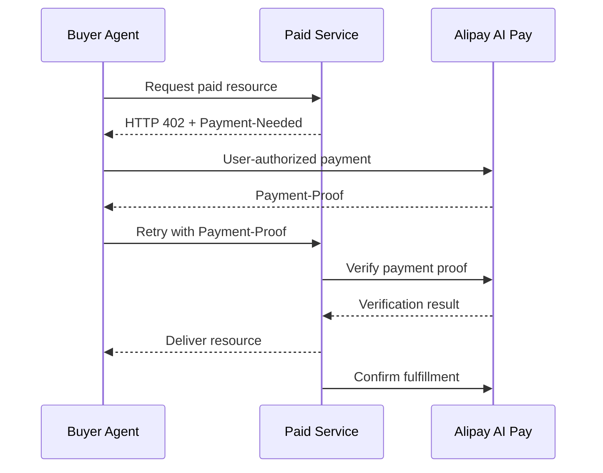

# ACT Protocol

ACT（Agentic Commerce Trust Protocol）是面向智能体商业交互的开放协议项目。

> [!IMPORTANT]
> ACT 协议正在修订。仓库中的 `specs/2.0/` 是现有工作版本，不应被理解为已经完成生产稳定性认证。修订期间的目标、边界和计划见[开源重构工作区](docs/open-source-restructure/README.md)。

## 你想做什么？

### 我在开发 Agent，需要支付能力

首期对齐支付宝 AI 付的 **Agent 支付**产品，公开接入基线是支付宝官方钱包与 Payment Skill/CLI。

- 按开发者路径接入：[Agent 支付 Getting Started](docs/getting-started/agent-payment.md)
- 了解产品与 ACT 的映射：[Agent Payment alignment](profiles/alipay-ai-pay/agent-payment-alignment.md)
- 查看支付宝官方接入资料：[AI 钱包使用指南](https://aipay.alipay.com/wallet-guide)
- 查看官方开源能力：[alipay/payment-skills](https://github.com/alipay/payment-skills)

### 我提供收费 API、MCP Tool 或 Skill

首期对齐支付宝 AI 付的 **AI 按量付费**产品，以官网公开的 HTTP 402 流程为接入基线。

- 按开发者路径接入：[AI 按量付费 Getting Started](docs/getting-started/metered-payment.md)
- 了解产品与 ACT 的映射：[Metered Payment alignment](profiles/alipay-ai-pay/metered-payment-alignment.md)
- 查看支付宝官方接入资料：[AI 按量付费接入指南](https://aipay.alipay.com/docs/ai-receive/MACHINE_PAY.html)
- 查看工作字段映射：[ACT—Alipay field mapping](profiles/alipay-ai-pay/field-mapping.md)

### 我要理解或实现 ACT

1. 阅读[现有协议概览](specs/2.0/overview.md)。
2. 查看[协议修订与开源重构计划](docs/open-source-restructure/05-revision-tracker.md)。
3. 了解 [ACT Core、Product Profile 与 Binding 的边界](docs/open-source-restructure/01-vision-and-principles.md#4-分层原则)。
4. 查看 [Alipay AI Pay Profile 工作草案](profiles/alipay-ai-pay/README.md)。
5. 查看 [Alipay AI Pay 双侧能力与 ACT 四域映射](profiles/alipay-ai-pay/domain-mapping.md)。
6. 查看 [双侧能力接入契约 v0.1](profiles/alipay-ai-pay/end-to-end-capability-contract.md)。

不确定应该选择哪条路径？从[接入方式选择页](docs/getting-started/README.md)开始。

## 一个机器支付闭环，两侧能力

首期不是把 Agent 支付和 AI 按量付费作为两个孤立产品分别开源，而是用 ACT 把它们连接为一条机器支付链路：

- **Agent 支付**赋予买方 Agent 支付能力：获得用户授权、理解支付要求、执行支付并返回支付凭证。
- **AI 按量付费**赋予卖方服务接受机器支付的能力：机器可读地出账、验证支付凭证、交付资源并确认履约。

在首期 HTTP 402 场景中，两侧能力形成如下闭环：



ACT Core 描述跨产品语义；Alipay AI Pay Profile 描述支付宝字段、API、Skill/CLI 和错误映射；HTTP 或 Skill/CLI Binding 描述消息如何传递。

July Preview 使用[双侧能力接入契约](profiles/alipay-ai-pay/end-to-end-capability-contract.md)区分买方能力、卖方能力和端到端互操作证据，不以单侧接入声明完整兼容。

## 当前文档状态

| 内容 | 位置 | 状态 |
|---|---|---|
| ACT 2.0 工作规范 | [`specs/2.0/`](specs/2.0/) | 修订中，不作生产稳定声明 |
| Alipay AI Pay Profile | [`profiles/alipay-ai-pay/`](profiles/alipay-ai-pay/) | Preview / Non-normative |
| 业务场景 | [`examples/scenarios/`](examples/scenarios/) | 说明性示例，部分术语待随协议修订 |
| 报文示例 | [`examples/payloads/`](examples/payloads/) | 工作示例，尚未形成完整一致性认证 |
| Python 项目 | [`impl/python/`](impl/python/) | 本地模拟 Demo，不是真实支付宝接入 |
| 重构计划 | [`docs/open-source-restructure/`](docs/open-source-restructure/) | Active |

## 现有协议工作版本

现有规范按照四个域组织：

| 域 | 现有文档 | 解决的问题 |
|---|---|---|
| ADD | [Authorization & Delegation](specs/2.0/authorization-delegation-domain-spec.md) | 用户意图与授权委托 |
| CID | [Commerce Interaction](specs/2.0/commerce-interaction-domain-spec.md) | Agent 与商户的商业交互 |
| PSD | [Payment Services](specs/2.0/payment-services-domain-spec.md) | 支付请求、执行与结果 |
| TSD | [Trust Services](specs/2.0/trust-services-domain-spec.md) | 身份、存证与争议 |

组件名称、消息结构和域边界可能随当前修订发生变化。新实现应同时关注[修订追踪表](docs/open-source-restructure/05-revision-tracker.md)。

支付宝产品不是第五个域，也不是与某一个域一一对应。Agent 支付和 AI 按量付费是同一机器支付闭环的买方与卖方能力，作为 Product Profile 跨四域协作；当前组件级关系见[双侧能力与 ACT 四域映射](profiles/alipay-ai-pay/domain-mapping.md)。

## Demo、Quickstart 与参考实现

本项目对开发者资产采用以下定义：

| 类型 | 含义 |
|---|---|
| Scenario | 解释角色和业务流程，不证明技术接入 |
| Demo | 可使用 Mock 展示体验，不证明真实支付 |
| Quickstart | 连接官方公开产品或沙箱的最短接入路径 |
| Reference Implementation | 声明并测试其协议覆盖范围的实现 |
| Conformance Suite | 判断实现是否满足 Core 或 Product Profile |

当前 `impl/python/` 属于 Demo。大会版本计划中的真实接入验证仍在建设，进度见[发布章程](docs/open-source-restructure/06-bund-release-charter.md)。

## 仓库结构

```text
act-protocol/
├── specs/2.0/                    # 现有协议工作版本与 Schema
├── profiles/alipay-ai-pay/       # 支付宝 AI 付 Profile 工作草案
├── examples/scenarios/           # 说明性业务场景
├── examples/payloads/            # JSON 工作示例
├── docs/getting-started/          # 开发者接入路径
├── impl/python/                  # 本地模拟 Demo
├── docs/open-source-restructure/ # 重构方案、路线图与追踪
└── scripts/                      # 仓库质量检查
```

## 本地质量检查

```bash
python3 scripts/check_repository.py
```

该检查覆盖 Markdown 本地链接、UTF-8/JSON 语法和 Python 语法。Schema 与示例的语义一致性测试仍在建设中。

## 贡献

贡献前请阅读：

- [贡献指南](CONTRIBUTING.md)
- [治理模型](GOVERNANCE.md)
- [行为准则](CODE_OF_CONDUCT.md)
- [安全披露](SECURITY.md)

协议正在修订。涉及 Core 对象、组件编号、状态机或 Schema 的修改，应先关联对应修订议题；产品事实应引用可公开访问的官方资料。

## 许可证状态

仓库当前声明规范文档采用 CC BY 4.0，代码、Schema 和示例采用 Apache 2.0，但根 `LICENSE` 所引用的完整许可证文件尚待补齐和维护者确认。完成许可证治理前，请勿仅依据 README 推断具体文件的授权范围。
