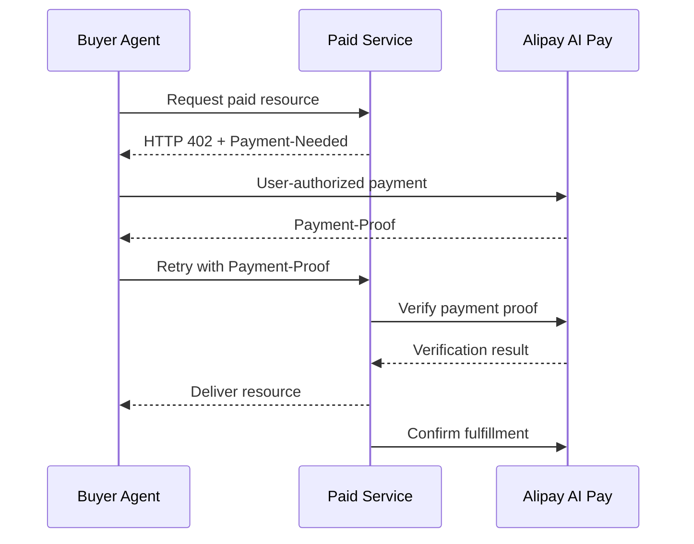

# ACT Protocol

[English](README.en.md) | 简体中文

ACT（Agentic Commerce Trust Protocol）是面向智能体商业交互的开放协议项目。当前开源主轴是**支付服务域（PSD）的一键式接入**：用候选 Core 描述支付工具、L1/L2/L3 场景和 A402，用 Product Profile 与 Quickstart 连接支付宝公开产品。

> [!IMPORTANT]
> 当前公开包只包含 `specs/2.1/` Candidate Working Draft，不包含旧版目录或旧版示例，也不代表已经完成生产稳定性认证。[ACT Protocol 官网](https://www.act-protocol.com/)及其四域规范是协议事实源；本仓库是便于评审、测试与接入的 Candidate 快照，不能替代官网发布。

ACT 2.1 四域 Candidate 已形成公开快照，并具备 A402 Candidate 机器契约；ADD、CID 和 TSD 目前是语义 Candidate，尚无正式机器 Schema。官网内容发生变化时，仓库必须先完成结构与语义差异评审，不能静默改写 Candidate。项目尚未形成公开 Release。版权主体和双许可证已确定，当前不要求额外签署贡献协议；安全问题通过 [AntSRC](https://security.alipay.com/) 私密报告。当前公开发布只剩公开仓库目标和干净发布快照。支付宝 Sandbox 由官网提供，只影响 `Sandbox Verified` 声明，不阻塞 ACT Candidate 或 Alipay Profile Preview；先看[当前发布说明](governance/releases/2026-08-03-candidate-publication.md)，精确状态见[机器可读分级门禁](governance/release-readiness.json)。

想先验证仓库能否工作、又不配置密钥或发起支付，可在仓库根目录运行：

```bash
npm --prefix code/examples/alipay/end-to-end-402 run local
```

这条本地 Golden Path 只验证 `402`、`Payment-Needed` 解码和“假 Proof 不得交付资源”的安全边界。它不会连接支付宝、执行支付或模拟支付成功；真实接入继续走下面的官方产品路径。

## 你想做什么？

### 我在开发 Agent，需要支付能力

首期对齐支付宝 AI 付的 **Agent 支付**产品，公开接入基线是支付宝官方钱包与 Payment Skill/CLI。

- 主路径：[Agent 支付 Getting Started](docs/getting-started/agent-payment.md)
- 查看支付宝官方接入资料：[AI 钱包使用指南](https://aipay.alipay.com/wallet-guide)

### 我提供收费 API、MCP Tool 或 Skill

首期对齐支付宝 AI 付的 **AI 按量付费**产品，以官网公开的 HTTP 402 流程为接入基线。

- 主路径：[AI 按量付费 Getting Started](docs/getting-started/metered-payment.md)
- 查看支付宝官方接入资料：[AI 按量付费接入指南](https://aipay.alipay.com/docs/ai-receive/MACHINE_PAY.html)

### 我要理解或实现 ACT

- 先看包含四域、典型场景和一键接入导航的[ACT 2.1 候选概览](specs/2.1/overview.md)
- 再理解整体分层：[ACT 项目框架](docs/architecture/README.md)

### 延伸阅读

实现细节、版本关系和项目计划集中在[支付宝 AI 付 Quickstart](code/examples/alipay/README.md)、[Alipay AI Pay Profile](integrations/profiles/alipay-ai-pay/README.md)、[机器可读版本清单](release-manifest.json)和[项目修订状态](governance/revision-status.md)，不需要在首次接入时全部阅读。版本变化见 [Changelog](CHANGELOG.md)。

## 一个机器支付闭环，两侧能力

首期不是把 Agent 支付和 AI 按量付费作为两个孤立产品分别开源，而是用 ACT 把它们连接为一条机器支付链路：

- **Agent 支付**赋予买方 Agent 支付能力：获得用户授权、理解支付要求、执行支付并返回支付凭证。
- **AI 按量付费**赋予卖方服务接受机器支付的能力：机器可读地出账、验证支付凭证、交付资源并确认履约。

在首期 HTTP 402 场景中，两侧能力形成如下闭环：



ACT Core 描述跨产品语义；公共 HTTP A402 Binding 描述消息如何传递；Alipay AI Pay Profile 描述支付宝字段、API、错误映射及产品专属 Skill/CLI 工作流。

[双侧能力接入契约](integrations/profiles/alipay-ai-pay/capabilities/end-to-end-contract.md)区分买方能力、卖方能力和端到端互操作证据，不以单侧接入或本地测试声明完整兼容。

## 当前文档状态

| 内容 | 位置 | 状态 | Normative | Production certified |
|---|---|---|---|---|
| ACT 2.1 公开候选 | [`specs/2.1/`](specs/2.1/overview.md) | Candidate Working Draft；不代表 SEP Candidate | 否 | 否 |
| Alipay AI Pay Profile | [`integrations/profiles/alipay-ai-pay/`](integrations/profiles/alipay-ai-pay/) | Preview | 否 | 否 |
| Quickstarts | [`code/examples/`](code/examples/) | 产品接入与验证路径 | 否 | 否 |
| Bindings | [`integrations/bindings/`](integrations/bindings/) | Preview | 否 | 否 |
| 项目路线与修订状态 | [`governance/`](governance/) | Active | 否 | 否 |
| 分级发布门禁 | [`governance/release-readiness.json`](governance/release-readiness.json) | ACT Candidate / Profile Preview / Sandbox Verified 分离；公开发布治理仍阻塞 | 否 | 否 |

**当前建议实现基线**：生产产品行为以所选 Product Profile 和官方产品文档为准；需要实现 ACT 时，只能把 2.1 Candidate Working Draft 作为公开评审和原型输入。当前任何组合都不得声明已通过 ACT Production Conformance。

## 当前候选域结构

ACT 按四个域组织；四域语义 Candidate 已公开同步，当前可执行接入仍采用 PSD-first。开发者可以先按[典型场景](specs/2.1/scenarios.md)选择授权级别，再进入所需域；无需为了 L1 + A402 接入实现全部 ADD/TSD 能力。

| 域 | 当前公开入口 | 状态 |
|---|---|---|
| ADD | [委托授权域候选](specs/2.1/domains/authorization-delegation.md) | 三组件 Candidate Working Draft；暂无正式 ISR/IAC Schema |
| CID | [商业交互域候选](specs/2.1/domains/commerce-interaction.md) | 四组件 Candidate Working Draft；暂无正式机器 Schema |
| PSD | [支付服务域候选](specs/2.1/domains/payment-services.md) | 当前开源主轴；六组件 Candidate Working Draft |
| TSD | [信任服务域候选](specs/2.1/domains/trust-services.md) | 可信存证 + 信用关联两个子篇 Candidate；暂无可运行 Trust Chain 或信用服务 |

组件名称、消息结构和域边界可能随当前修订发生变化。实现者应同时关注[规范修订状态](specs/2.1/revision-status.md)和[项目修订追踪表](governance/revision-status.md)。

支付宝产品不是第五个域，也不是与某一个域一一对应。Agent 支付和 AI 按量付费是同一机器支付闭环的买方与卖方能力，作为 Product Profile 跨四域协作；当前组件级关系见[双侧能力与 ACT 四域映射](integrations/profiles/alipay-ai-pay/mappings/domains.md)。

## Demo、Quickstart 与参考实现

本项目对开发者资产采用以下定义：

| 类型 | 含义 |
|---|---|
| Scenario | 解释角色和业务流程，不证明技术接入 |
| Demo | 可使用 Mock 展示体验，不证明真实支付 |
| Quickstart | 连接官方公开产品或沙箱的最短接入路径 |
| Reference Implementation | 声明并测试其协议覆盖范围的实现 |
| Conformance Suite | 判断实现是否满足 Core 或 Product Profile |

当前 Showcase 通过 Guided Preview 解释协议流程，并可回放官方沙箱证据；它不替代真实接入。真实接入从 [Quickstarts](code/examples/README.md) 开始，本地演示与正式 Sandbox 证据的边界见各 Quickstart README。

## 仓库结构

```text
act-protocol/
├── specs/                        # 版本化协议、A402 Schema 与断言
├── docs/                         # 开发者指南、概念与架构说明
├── integrations/                 # 跨产品 Binding 与产品 Profile
├── code/                         # 可运行示例与体验型 Web 客户端
├── governance/                   # 公开决策、审计与发布状态
├── release-manifest.json         # 机器可读版本、状态和组件依赖
└── scripts/                      # 仓库质量与示例检查
```

## 本地质量检查

完整检查需要 Python 3、Node.js 18+、JDK 8+ 和 Maven 3.8+：

```bash
./scripts/verify.sh
```

统一验证会运行仓库完整性检查、买方与端到端 Node.js 测试，以及卖方 Maven 测试。仅运行不需要项目依赖的静态检查时，可执行 `python3 scripts/check_repository.py`。正式一致性测试仍在建设中。

## 贡献

贡献前请阅读：

- [贡献指南](CONTRIBUTING.md)
- [治理模型](GOVERNANCE.md)
- [维护分工](MAINTAINERS.md)
- [行为准则](CODE_OF_CONDUCT.md)
- [安全披露](SECURITY.md)

协议正在修订。涉及 Core 对象、组件编号、状态机或 Schema 的修改，应先关联对应修订议题；产品事实应引用可公开访问的官方资料。

## 许可证

Copyright (c) 2026 Ant Group Co., Ltd.。规范和说明文档采用 CC BY 4.0；代码、Schema 和可执行示例采用 Apache 2.0。当前不要求额外签署贡献协议或 DCO sign-off；贡献者须确认有权提交，接受的贡献按对应文件许可证发布。详细目录边界见 [LICENSE](LICENSE) 和 [NOTICE](NOTICE)。
