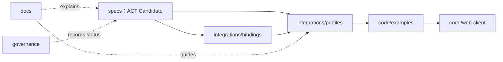

# Repository layout

> 状态：Active / Non-normative。本文描述当前仓库的信息架构，不赋予任何协议内容 Normative 或 Stable 状态。

ACT 借鉴 AP2 将“文档”和“可运行代码”分开的做法，同时保留独立的 `specs/`：ACT 2.1 仍是版本化 Candidate，Schema、fixtures 和 assertions 必须与教程及产品实现保持清晰边界。

## 顶层结构

```text
act-protocol/
├── specs/                         # 版本化协议候选与机器契约
│   └── 2.1/
│       ├── domains/               # ADD、CID、PSD、TSD 与跨域协商
│       ├── a402/                  # A402 规范、Schema、fixtures、assertions
│       ├── overview.md
│       ├── scenarios.md
│       └── revision-status.md
├── docs/                          # 开发者指南与架构解释
│   ├── getting-started/
│   └── architecture/
├── integrations/                  # 协议到运行时和产品的适配
│   ├── bindings/                  # 跨产品 Binding
│   └── profiles/                  # 产品 Profile
├── code/                          # 可运行但非规范性的资产
│   ├── examples/                  # 最短接入与验证示例
│   └── web-client/                # 演示与证据回放客户端
├── governance/                    # 决策、审计、发布门禁与项目记录
│   ├── decisions/
│   ├── audits/
│   └── releases/
├── scripts/                       # 仓库检查和验证入口
└── release-manifest.json          # 机器可读组件状态和依赖
```

项目尚未发布 SDK，也尚未形成正式一致性套件，因此不建立空的 `code/sdk/` 或顶层 `conformance/`。出现真实资产后再增加目录，避免用空结构暗示能力已经存在。

## 目录职责

| 目录 | 回答的问题 | 禁止混入的内容 |
|---|---|---|
| `specs/` | 实现者需要评审和遵守哪些候选协议语义 | 产品开户说明、营销文案、单一产品 API |
| `docs/` | 开发者如何理解架构并完成接入 | 新的规范性要求、内部审批材料 |
| `integrations/bindings/` | HTTP 等跨产品运行时如何承载协议消息 | 支付宝专属字段和工作流 |
| `integrations/profiles/` | 具体产品如何映射 ACT 字段、状态、API 和错误 | 对 ACT Core 的重复定义 |
| `code/examples/` | 如何以最短路径连接产品或验证协议流程 | 假支付成功、未声明覆盖范围的“参考实现” |
| `code/web-client/` | 如何展示流程或回放脱敏证据 | 真实沙箱的重复实现、生产可用声明 |
| `governance/` | 决策如何形成、发布门禁是否满足 | 协议正文或产品操作手册 |
| `scripts/` | 如何自动检查仓库、Schema 和示例 | 依赖脚本行为才能成立的协议语义 |

## 依赖方向



依赖只能从实现资产指向协议事实源：示例可以消费 Profile，Profile 可以引用 Core 和 Binding，但示例代码不能反向决定协议语义。支付宝产品行为以 AIPay 官网及官方接入文档为事实来源；本仓库不实现官网沙箱。

## 开发者阅读路径

| 目标 | 最短路径 |
|---|---|
| 为 Agent 增加支付能力 | 根 README → Agent Payment 指南 → Alipay Profile → Buyer Example |
| 为 API、MCP Tool 或 Skill 收款 | 根 README → Metered Payment 指南 → Alipay Profile → Seller Example |
| 理解 ACT 2.1 | 根 README → 2.1 Overview → 具体 Domain → A402（如适用） |
| 参与协议修订 | Contributing → Governance → Revision Status → Decision Register |

## 发布边界

- `specs/2.1/` 全部保持 Candidate / Non-normative，直至完成正式协议治理。
- `integrations/` 和 `code/` 不得声明 ACT Production Conformance。
- 私有申请、活动计划和内部确认材料不属于公开目录，不得成为公开 Markdown 链接、检查项或发布门禁证据。
- `python3 scripts/create_public_snapshot.py --check` 会从当前有效仓库文件建立临时公开快照，排除私有筹备材料和忽略文件，并在快照内重新执行仓库完整性检查。
- 历史 ACT 2.0 只保留在 Git 历史中，不进入当前公开目录。
- SDK、参考实现和 conformance suite 只有在真实实现、覆盖声明和测试证据齐备后才建立。
