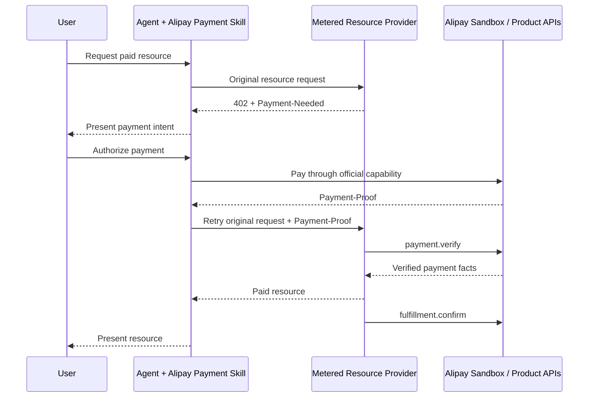

# 端到端 HTTP 402 验证

> 状态：Validation plan / Non-normative  
> 目标：证明 Agent 支付与 AI 按量付费可以通过支付宝官方公开能力形成闭环

本指南不是新的支付实现。它规定如何组合并验证两个官网产品路径，形成“接入 ACT Profile 即可接入支付宝 AI 付”的公开证据。

## 1. 验证对象

## 2. 参与组件

| 组件 | 要求 | 事实来源 |
|---|---|---|
| Agent Runtime | 能加载支付宝官方 Skill/CLI，并保留原任务上下文 | 待选定首个运行时 |
| Wallet/Payment | 使用支付宝官方钱包和 Payment Skill | [官方钱包指南](https://aipay.alipay.com/wallet-guide) |
| Paid Resource | 按官网返回 402、验凭证和确认履约 | [按量付费接入指南](https://aipay.alipay.com/docs/ai-receive/MACHINE_PAY.html) |
| Payment Verification | 调用支付宝公开验凭证 API | [payment.verify](https://ideservice.alipay.com/cms/site/0j7uot) |
| Fulfillment Confirmation | 调用支付宝公开履约回执 API | [fulfillment.confirm](https://ideservice.alipay.com/cms/site/0j7sw0) |
| Environment | 使用支付宝官网提供的 Sandbox/测试能力 | [AI 付产品概览](https://aipay.alipay.com/docs/overview.html) |

## 3. 四域验证检查点

端到端验证不只证明 HTTP Header 可以往返，还要证明四域上下文能够贯通：

| ACT 域 | 本场景的检查点 | 最小证据 |
|---|---|---|
| ADD | 用户请求被整理为可理解的支付意图，并在首期路径中逐笔确认 | 脱敏 `intent_id`、意图摘要和确认结果 |
| CID | 资源、商户、金额、币种和订单在支付前已确定 | 脱敏资源 ID、商户订单号和交易确认摘要 |
| PSD | 钱包可用；402、Proof、官方验款和支付结果形成闭环 | 脱敏账单、验证结果和支付宝交易号 |
| TSD | 意图、订单、支付和履约证据可以关联，且没有把产品日志冒充标准存证 | 关联 ID、事件时间和证据来源 |

首期用户逐笔确认对应 `PSD-PAY-INS`，同时消费当前官网放在 `PSD-PAY-AUP` 下的 402 交互框架。这一跨组件组合必须标记为协议待确认，不能被测试结果直接提升为协议结论。完整说明见[产品与 ACT 四域映射](../../profiles/alipay-ai-pay/domain-mapping.md)。

## 4. 验证前准备

### Agent 侧

- 按[Agent 支付 Getting Started](agent-payment.md)安装官方 Skill。
- 使用官方流程完成钱包状态检查和必要授权。
- 确认 Agent 能安全保存一次任务的原始 HTTP 请求上下文。

### 服务侧

- 按[AI 按量付费 Getting Started](metered-payment.md)完成产品和沙箱配置。
- 准备一个无副作用或可安全重复测试的付费资源。
- 服务端保存原账单、验证结果和履约幂等记录。

### 证据收集

测试记录只能保存脱敏信息：

- 运行时与 Skill/CLI 版本。
- Profile 和代码提交版本。
- 沙箱环境标识。
- 脱敏订单号、交易号和资源 ID。
- 各生命周期节点的时间和结果。
- 错误分类和实际恢复动作。

不得保存私钥、支付密码、绑定码、完整支付凭证或可重放的请求。

## 5. Happy Path

1. 用户要求 Agent 获取测试资源。
2. Agent 发出原始资源请求。
3. 服务返回 402 和有效 `Payment-Needed`。
4. Agent 展示账单关键信息。
5. 用户通过官方能力授权并完成沙箱支付。
6. Agent 携带官方 `Payment-Proof` 重试原请求。
7. 服务调用支付验证 API。
8. 服务核对 active、金额、订单和资源。
9. 服务记录幂等占用并返回资源。
10. 服务调用履约确认 API。
11. Agent 将资源交给用户并结束原任务。

成功证据必须同时包含：

- 真实 402 响应。
- 官方支付能力产生的结果。
- 支付宝验凭证 API 的脱敏结果。
- 资源交付记录。
- 履约确认结果或可审计的重试状态。

## 6. 必测异常

| 用例 | 构造方式 | 预期结果 |
|---|---|---|
| 账单过期 | 使用已过 `pay_before` 的账单 | 不支付或不交付，获取新账单 |
| 缺失 Proof | 不携带 `Payment-Proof` | 返回 402，不交付 |
| Proof 无效 | 使用无效测试凭证 | 验证失败，不交付 |
| 金额不一致 | 本地原账单与验证金额不同 | 不交付并记录 mismatch |
| 订单不一致 | 验证返回订单与本地订单不同 | 不交付 |
| 资源不一致 | Proof 对应另一个资源 | 不交付 |
| 重放 | 同一交易并发或再次请求 | 返回已保存结果或拒绝，不重复履约 |
| 验证 API 临时失败 | 使用官方测试能力或受控故障注入 | 重试相同验证，不直接交付或重复支付 |
| 履约确认失败 | 受控故障注入 | 资源交付证据保留，确认调用幂等重试 |
| 用户拒绝 | 在官方支付流程取消 | Agent 安全终止原任务 |

## 7. 发布门槛

端到端验证只有满足以下条件才能进入大会发布证据：

- [ ] Agent 与服务均使用公开可获取的产品能力。
- [ ] 测试者不需要内部文档或内部工具才能复现。
- [ ] Happy Path 连续执行三次成功。
- [ ] 所有必测异常不会造成未付款交付或重复交付。
- [ ] 文档中的官网链接和产品字段与发布快照一致。
- [ ] ADD、CID、PSD、TSD 的关联证据完整，且产品证据与 ACT 标准事件未混淆。
- [ ] 测试证据完成脱敏且不含可重放凭证。
- [ ] 观岳确认涉及的 ACT Core 候选语义。
- [ ] 念箴确认 Alipay Profile 映射和产品验证结果。

## 8. 当前开放项

- 首个支持官方 Skill/CLI 的 Agent 运行时尚待选择。
- 需要确认官网 Sandbox 是否能在同一链路覆盖 Agent 钱包买方和 402 卖方；如果分段验证，需要定义证据如何组合。
- 金额单位、Proof 编码、`client_session` 条件和第三方代调用关系仍需产品复核。
- Core 生命周期和 `valid_next_actions` 尚待协议修订确认。
- 402 框架跨 `PSD-PAY-INS`、`PSD-PAY-DEL`、`PSD-PAY-AUP` 复用，以及 CID/TSD 边界尚待协议修订确认。

这些开放项在[修订追踪表](../open-source-restructure/05-revision-tracker.md)中维护。
