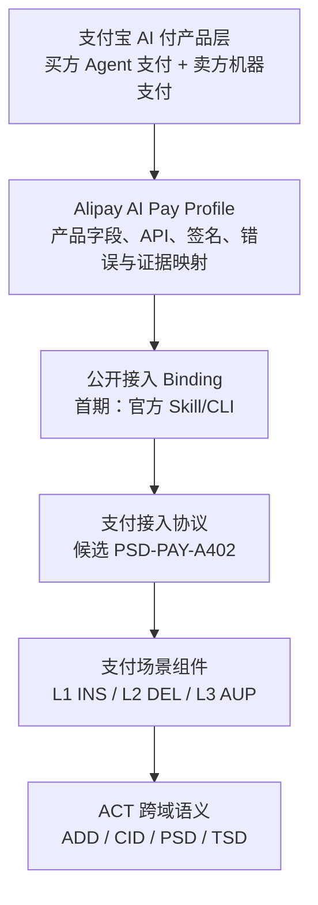

# ACT v2.1 修订方向与开源框架对齐

> 状态：Active / Non-normative
> 对齐日期：2026-07-22
> 适用范围：外滩大会前的 Agent 支付与 AI 按量付费开源工作

## 1. 对齐原则

本页记录协议负责人最新修订分析对开源框架的影响，不替代正式 ACT 规范，也不把内部材料作为外部开发者的接入前置条件。

开源项目同时维护两条基线：

- **协议结构基线**：跟踪 ACT v2.1 修订方向；结论进入公开规范前均标记为候选。
- **产品事实基线**：支付宝字段、编码、签名、API、Skill/CLI 和沙箱操作始终以 [AIPay 官网](https://aipay.alipay.com/callpay)及其公开接入文档为准。

因此，本轮先调整信息架构、映射和决策追踪，不直接修改 `specs/2.0/` 或现有 Schema。

## 2. 目标结构

这里有四个必须分开的概念：

1. **场景层**回答 Agent 凭什么支付、用户是否在场、授权范围是什么。
2. **接入协议层**回答支付要求、支付凭证、验证结果如何交换。
3. **Binding 层**回答 Skill/CLI、HTTP、未来 MCP/API 如何承载或封装协议语义。
4. **产品 Profile 层**回答支付宝具体字段、接口、签名和产品状态如何映射。

## 3. PSD 对齐结论

| 层次 | v2.1 修订方向 | 开源项目处理 |
|---|---|---|
| L1 场景 | `PSD-PAY-INS`：用户在场，支付决定由用户作出；资金移动前由 PSP 逐笔确认身份与授权 | 外滩大会首期 Agent 支付基线 |
| L2 场景 | `PSD-PAY-DEL`：定向委托支付；用户预先确定目标并签发 IAC，执行时无需逐笔身份确认 | 后续能力，保留协议与产品验证入口 |
| L3 场景 | `PSD-PAY-AUP`：自主化委托支付；使用 BOUNDED IAC，可多轮、多笔执行，可选子账户 | 后续能力，不作为首期合规声明 |
| 支付接入 | 候选 `PSD-PAY-A402`：独立定义 HTTP 402、Headers、载荷、状态、错误、幂等和防重放 | 从 AUP 场景语义中解耦；首期由 INS 引用 |
| 其他接入 | MCP/API 是可替换接口方式，修订分析暂未将其定义为独立支付协议组件 | 首期不声明原生 MCP/API 支付 Binding |

候选 A402 可被 INS、DEL、AUP 引用。场景组件继续负责 IAC、金额、商户、支付方式和子账户等授权约束；A402 不替代这些约束。

## 4. A402 候选边界

修订方向建议 A402 独立覆盖：

- HTTP 402 触发和原始资源请求恢复。
- `Payment-Needed`、`Payment-Proof`、候选 `Payment-Validation`。
- 基础载荷、`method_id` 与支付方式扩展。
- 公共状态机、超时、幂等、防重放和错误。
- 买方 Agent、卖方服务、PSP、委托方与资源提供方的责任。
- 通过 `CID-PCA-NEG` 或等价机制协商 `method_id`、`psp_id`、`endpoint` 和 `method_schema_url`。

这些是协议候选范围，不等于支付宝官网已经公开了所有对应字段和消息。

修订分析中的候选公共状态为 `CREATE`、`WAIT_BUYER_PAY`、`WAIT_SELLER_FULFILLMENT`、`WAIT_BUYER_RECEIPT`、`TRADE_FINISHED` 和 `TRADE_CLOSED`。它们目前只用于后续 Core/Profile 状态映射和测试设计，不能覆盖支付宝官网公开的产品状态。

## 5. 与支付宝公开产品的差异控制

| 主题 | v2.1 修订方向 | 当前公开产品事实 | 开源处理 |
|---|---|---|---|
| Header 编码 | 三个 Header 均建议使用 Base64URL UTF-8 JSON | 官网当前对 `Payment-Needed` 与 `Payment-Proof` 的编码描述并不完全相同 | Profile 继续按官网实现，记录为 `PRODUCT-REVIEW`，不能由协议草案覆盖 |
| `Payment-Validation` | 候选公共响应语义 | 官网卖方路径公开服务端验款，但未明确要求同名 Header 回传买方 | 保持 `PRODUCT-REVIEW`，先验证产品响应和 Skill/CLI 封装行为 |
| A402 状态机 | 候选公共交易状态包含创建、待支付、待履约、待收货、完成和关闭 | 官网使用产品支付与履约状态 | Core 状态只作候选；Profile 后续提供显式映射 |
| AI 钱包 | 聚合产品，不要求 ACT 规范其完整产品生命周期 | 官网维护钱包开通、授权、检查和解绑流程 | 产品操作留在官网；ACT 仅讨论可引用的支付工具绑定语义 |
| 购物车与订单 | INS 场景可由 CID 完成购物车确认，支付请求不必承载完整购物车 | 官网 402 账单包含产品所需资源和订单字段 | `Payment-Needed` 引用或携带最小已确认交易事实，CID/PSD 边界继续评审 |
| ASL 依赖 | DEL/AUP 的身份、连接、授权和密钥安全依赖 ASL 能力 | 当前公开四域入口未形成同等清晰的开发者路径 | 正式依赖必须先进入公开规范，开源文档不隐式假设其存在 |

## 6. 对仓库的影响

| 区域 | 本轮动作 | 后续准入条件 |
|---|---|---|
| `specs/2.0/` | 不修改 | v2.1 候选经协议治理形成公开草案 |
| 开源重构文档 | 引入“场景 / 接入协议 / Binding / Profile”四层结构 | 评审确认信息架构 |
| Alipay Profile | 将首期闭环描述为 `PSD-PAY-INS + PSD-PAY-A402` 候选组合 | A402 公开规范、产品字段复核、沙箱证据 |
| Getting Started | 保持官网操作入口，补充候选协议位置 | 不复制官网开户、密钥和 API 手册 |
| Quickstart | 暂不实现新的协议消息 | Profile 候选和真实端到端证据通过 |
| Conformance | 预留 A402 状态、错误、幂等和防重放测试 | Schema 与状态机公开后实现 |

## 7. 接下来需要闭环的决定

1. 发布并确认 `PSD-PAY-A402` 的正式编号、版本和与 v2.0 AUP 的兼容迁移规则。
2. 确认 A402 公共状态机、三类 Header、错误、超时、幂等和防重放的规范文本。
3. 明确 CID 交易确认对象与 `Payment-Needed` 的引用或内嵌规则。
4. 公开说明 DEL/AUP 所依赖的身份、授权和密钥安全能力。
5. 用支付宝沙箱验证 INS + A402 + 官方 Skill/CLI + Alipay Profile 的完整闭环。
6. 对齐买方和卖方履约确认调用，确定权威状态与幂等责任。

本次修订分析中的信用服务域没有形成可执行的新要求，因此本轮开源框架不新增信用服务组件或交付项。

协议候选由观岳牵头；开源结构、Alipay Profile、接入文档、验证和发布由念箴牵头。
