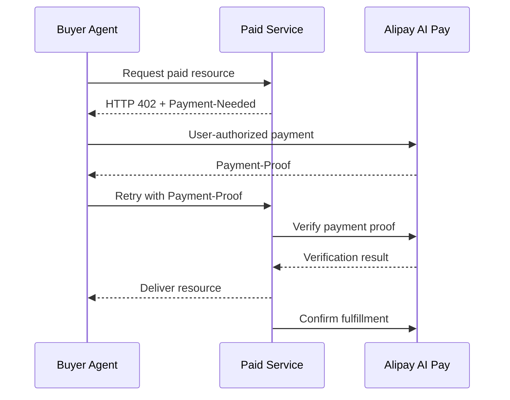

# ACT 开源重构工作区

> 状态：Draft / Non-normative  
> 基线分支：`feat_alignment`  
> 工作分支：`codex/open-source-restructure`  
> 建立日期：2026-07-15

本目录用于在 ACT 协议修订期间，先行确定开源项目的信息架构、开发者旅程、协议层与支付宝产品层边界，以及后续工作的可追踪计划。

这里的内容不是 ACT 正式协议，不新增正式组件编号，不修改既有 Schema，也不使用 MUST、SHOULD 等规范性措辞宣布尚未完成的协议结论。

## 首期目标

首期聚焦两个公开产品场景：

1. **Agent 支付**：Agent 安装支付宝钱包和支付能力，完成用户授权、支付执行与结果查询。
2. **AI 按量付费**：API、MCP Tool 或 Skill 服务提供方通过 HTTP 402 声明价格、验证支付凭证并完成资源交付。

二者不是两条割裂的支付协议，而是一个端到端闭环的买方侧和卖方侧：

## 文档导航

| 文档 | 解决的问题 | 当前状态 |
|---|---|---|
| [目标与原则](01-vision-and-principles.md) | 为什么重构、边界是什么、如何判断成功 | Draft |
| [目标信息架构](02-target-information-architecture.md) | 最终仓库如何组织，开发者从哪里进入 | Draft |
| [支付宝 AI 付公开接入基线](03-alipay-integration-baseline.md) | 官网真实公开了哪些接入路径，ACT 如何承接 | Draft，产品事实待复核 |
| [阶段计划](04-roadmap.md) | 先做什么、后做什么、每阶段如何验收 | Draft |
| [修订追踪](05-revision-tracker.md) | 协议修订主题、决策、开放问题如何持续追踪 | Active |
| [2026 外滩大会发布章程](06-bund-release-charter.md) | 大会前发布什么、谁负责、何时冻结 | Accepted |
| [协议决策简报](08-protocol-decision-brief.md) | 双侧机器支付进入 Core 修订前需要决定的最小问题包 | Partially aligned |
| [ACT v2.1 修订方向对齐](09-v2.1-revision-alignment.md) | 场景组件、A402 接入协议、Binding 与产品 Profile 如何分层 | Active |

## 当前工作约束

- 现有 `specs/2.0/` 暂不在本工作流中修改。
- 暂不新增或修订正式 JSON Schema。
- 暂不把现有 Demo 改写为参考实现；先明确 Demo、Quickstart 和 Reference Implementation 的定义。
- 支付宝产品层仅引用可公开访问的官网、开放平台文档和开源仓库。
- 内部讨论材料只能作为问题线索，不能成为开源项目的唯一事实来源。
- 所有未决协议内容进入[修订追踪表](05-revision-tracker.md)，待修订结论确认后再进入正式规范。

## 文档状态约定

| 状态 | 含义 |
|---|---|
| Draft | 方案草案，可讨论，不构成协议承诺 |
| Active | 正在维护的计划或问题清单 |
| Accepted | 已完成评审，可用于指导后续实现，但不等同于协议发布 |
| Normative | 正式协议内容；只有协议发布流程可以授予此状态 |
| Superseded | 已被新方案替代，保留用于追踪历史 |

## 下一次评审建议

首次方案评审只需要确认四件事：

1. 首期范围是否保持为 Agent 支付与 AI 按量付费。
2. ACT Core、支付宝产品 Profile、Transport/Binding 三层边界是否成立。
3. 公开接入基线是否准确覆盖支付宝官网实际能力。
4. 协议修订结果进入正式规范前的准入条件是否足够清晰。
