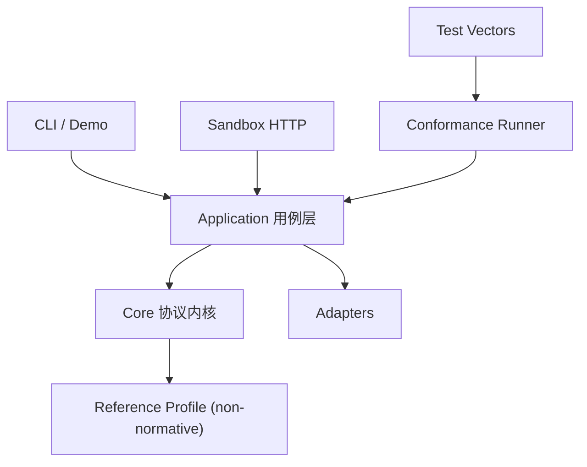
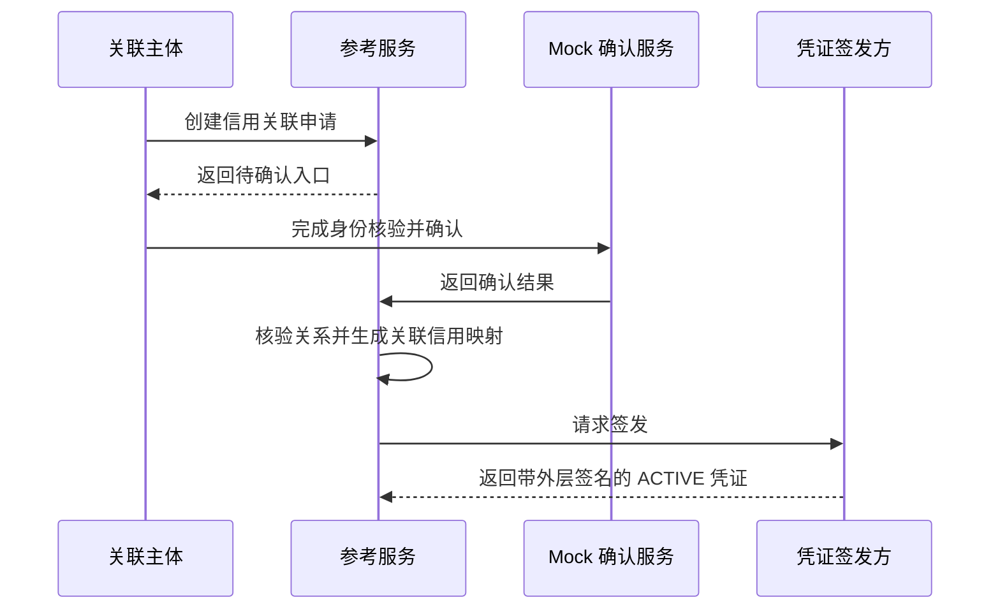
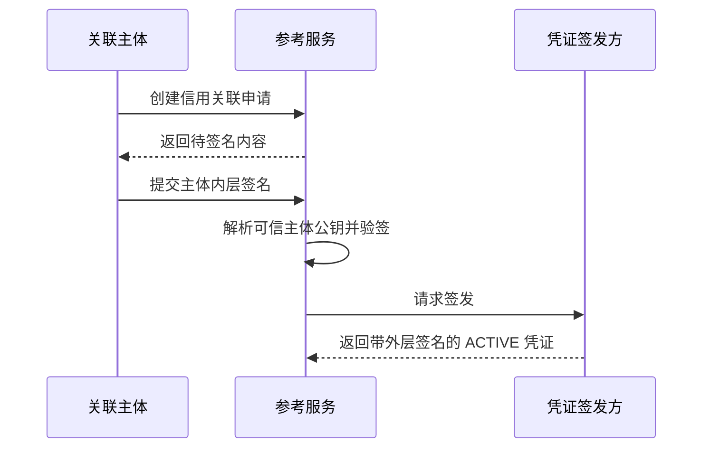

# 架构说明

> 本文说明 `code/samples/tsd-crd-reference/` 的参考实现架构，不规定 ACT 2.1 的唯一实现方式。

## 目标

架构服务于三个目标：

1. 协议规则可以脱离 HTTP、CLI 和具体机构系统独立测试。
2. 身份、信用、映射和存储能力可以替换。
3. 同一批测试向量既能验证参考实现，也能验证第三方实现。

## 分层

依赖方向从入口指向用例和核心。`code/samples/tsd-crd-reference/src/core` 不依赖 HTTP、CLI、文件系统或具体确认服务。

## 目录职责

| 目录 | 职责 |
| --- | --- |
| `code/schemas/tsd-crd/reference-v1` | Schema、OpenAPI、标准报文和测试向量 |
| `code/samples/tsd-crd-reference/src/core` | 协议对象、不变量、签名投影、状态机、授权和验证规则 |
| `code/samples/tsd-crd-reference/src/application` | ASC、MAP、LCM、AUTH、VER 用例编排 |
| `code/samples/tsd-crd-reference/src/adapters` | 内存存储、Mock 身份确认、虚构信用和固定映射 |
| `code/samples/tsd-crd-reference/src/http` | 本地 Sandbox HTTP 入口 |
| `code/samples/tsd-crd-reference/src/cli` | Demo 和命令行入口 |
| `code/samples/tsd-crd-reference/src/conformance` | 测试向量加载、执行和报告 |
| `code/schemas/tsd-crd/reference-v1/test-vectors` | 与实现无关的正常和异常向量 |

## 五组件映射

| 组件 | 核心职责 | 外部能力 |
| --- | --- | --- |
| ASC | 申请校验、主体确认、关系核验、凭证签发 | 身份确认、关系证明、签发密钥 |
| MAP | 映射三要素、来源和规则版本校验 | 信用声明、映射策略 |
| LCM | 状态机、替换和状态有效性 | 状态存储、时钟 |
| AUTH | 授权范围、期限、频率和撤销 | 授权存储、计数器 |
| VER | 两级验证、原因码和最小披露 | 密钥解析、状态、信用和授权查询 |

适配器只提供这些能力，不承载协议核心判断。

`createReferenceSuite` 提供两个密钥解析端口：`resolveRelyingPartyPublicKey` 和 `resolveSubjectPublicKey`。所有需要请求证明的操作都必须通过相应端口解析可信公钥并验签；未配置端口或无法解析时失败关闭。Demo 显式注入进程内测试身份目录，生产适配器必须接入可信目录。

## 默认 ATTESTED 流程

默认流程不登记 Agent 公钥，不要求 nonce 挑战或 Agent 私钥签名。

## DIRECT 流程

待签名内容应覆盖协议要求的关联关键字段和防重放要素。具体字段、规范化和算法由 Reference Profile 定义。

DIRECT 待签名包显式携带原申请时间和防重放要素；二者与申请标识、主体、Agent、目的、范围、有效期和映射信息一起进入主体内层签名。Sandbox 不信任确认请求临时携带的裸公钥；Demo 通过显式测试身份目录解析主体公钥，生产实现必须替换为企业证书、可信密钥目录、身份核验结果或等效机制。

Agent 密钥持有证明目前只有[设计说明](agent-key-possession-extension.md)，没有实现代码、接口或测试，不属于 P0。

## 数据和状态

P0 使用进程内存保存申请、凭证、授权、状态和验证记录。进程重启后数据可以丢失，这是 Sandbox 的明确边界。

生产实现应替换为具备事务、并发控制、审计、备份和访问控制的存储。核心字段变化不能覆盖原凭证，必须签发新凭证并保留前序引用。

## 零第三方依赖

P0 使用 Node.js `>= 22.18` 内置能力，不引入第三方包。这样可以降低供应链风险，并让示例更容易审阅。

新增依赖前需要说明：

- 内置能力为什么无法满足。
- 许可证和维护状态。
- 供应链与体积影响。
- 是否会影响浏览器或其他运行时的复用。
