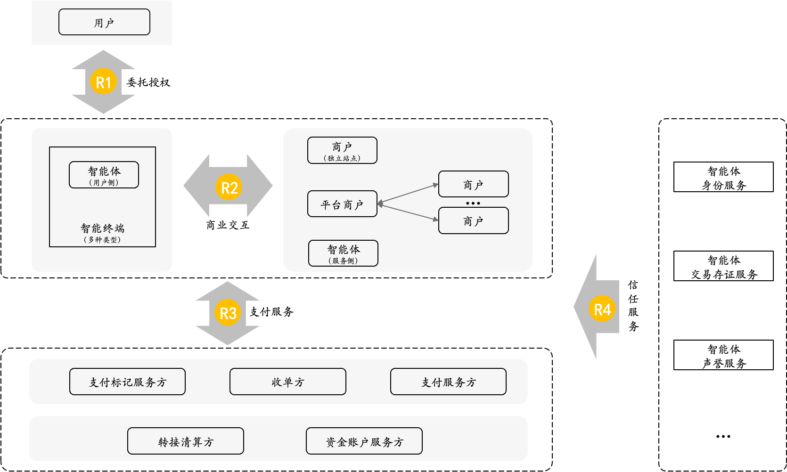
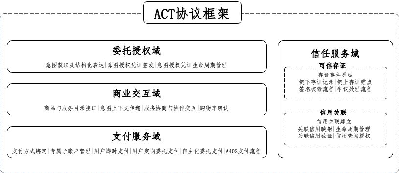

# ACT 2.1 协议概览

中文 | [English](overview.en.md)

> **状态：ACT 2.1 Specification / Final / Normative**
> **正文完整转录自 2026-08-11 定稿中文协议；仅清理语雀排版标签，将语雀图示保存为仓库本地图片，并保留文字转录。**

# 引言
在以信息检索和页面浏览为主的互联网商业阶段，用户是商业决策和支付行为的直接执行者。交易发生在用户与商业平台之间，用户通过界面实时查看商品、主动点击下单、逐笔确认支付。随着 AI 智能体技术的深度渗透，这一前提正在改变。智能体开始代表用户进行服务发现、商品比价、交易协商乃至支付执行，用户从"实时操作者"演变为"目标设定者与授权人"。

这一变化在带来效率提升的同时，也带来了传统商业与支付体系需要面对和解决的信任挑战：

+ 首先，在智能体商业中，交易的责任主体发生了分离。用户负责提出目标和约束，智能体负责执行决策与操作，商户和支付服务方看到的则是被代理后的交易请求；“谁的意愿、谁的操作、谁应负责”不再像传统电商那样天然一致。
+ 其次，交易依据从“用户实时确认”转变为“用户事前授权、智能体事后执行”。这意味着，系统不仅要回答一笔交易是否成功，更要回答这笔交易是否在用户原始授权边界内、是否忠实执行了用户意图、以及执行结果是否能够被追溯和解释。
+ 最后，智能体的执行效率可能带来交易笔数和交易复杂度的显著提升，相应的争议、审计与风控压力也会同步放大。传统依赖人工逐笔复核的处理方式将难以适应规模化代理交易，商业系统需要可被自动化处理的标准化记录与验证机制。

总之，智能体商业带来的不是单一环节的安全问题，而是交易信任基础的整体迁移：信任不再建立在“人实时在场”的天然前提上，而必须通过一套可表达、可传递、可校验、可追溯的协议机制来显式建立。

ACT（Agentic Commerce Trust Protocol，智能体商业信任协议）是一套应对上述挑战而设计的应用层信任协议，覆盖从用户意图表达、委托授权、商业交互、支付执行到可信存证的完整商业链路。ACT 不替代现有的支付网络、商户系统或身份基础设施，而是在其之上提供一层面向智能体商业场景的信任编排能力，使各参与方能够在统一的协议框架下实现授权约束、交易一致性、支付控制与执行可验证性。

本文档为 ACT 协议总纲，定义协议的范围边界、诞生背景需求、设计目标与原则、整体框架、参与方角色及术语体系，是各域规范文档的上位参考文件。

# 范围
本协议面向智能体参与商业交易的场景，规范用户、智能体、商户、支付服务方及相关信任服务提供方之间，为完成一笔可被授权、可被执行、可被验证的商业交易所需的应用层信任协作机制。

本协议主要规范以下四类协议活动：

+ 委托授权：围绕用户意图表达、执行权限授予及其效力边界所形成的协议行为。
+ 商业交互：围绕商品或服务发现、交易条件确认及支付前商业共识形成所发生的协议行为。
+ 支付执行：围绕支付凭据使用、支付请求发起、支付结果返回及其与上游授权和交易确认关系保持一致所发生的协议行为。
+ 可信存证：围绕关键商业事件记录、执行事实核验及后续争议处理支持所发生的协议行为。

本协议不规范以下内容：

+ 智能体与用户之间的具体交互体验实现，包括前端界面、自然语言对话方式、提示词工程及任务编排策略。
+ 商业参与方自身的经营管理规则，包括商品定价、库存管理、订单履约、售后处理及其他业务运营细节。
+ 底层支付基础设施的资金清算与结算规则。
+ 各参与机构内部的风控模型、反欺诈算法及内部审核策略等。
+ 底层通信传输、基础设施部署、系统运维及其他不直接属于应用层信任协作范畴的技术实现细节。

# 智能体商业信任需求
ACT 将智能体商业中的核心需求归纳为四类：委托授权（R1）、商业交互（R2）、支付服务（R3）和信任服务（R4）。四类需求分别对应智能体为何可以代表用户行动、如何形成交易共识、如何完成支付执行以及如何对执行结果进行验证。

上述四类需求共同构成 ACT 协议设计的基础，并对应后续四大能力域的划分。

**委托授权需求（R1）**

+ 委托授权需求解决的是用户意图如何被可信表达，并成为后续商业行为的统一依据。
+ 在用户实时在场场景下，结构化的意图表达有助于支撑后续商品匹配、交易协商和支付确认；在用户不实时在场场景下，这种表达进一步构成智能体自主执行的授权基础。核心包括两点：一是用户意图委托授权本身应可信，二是意图与授权边界应能够被结构化表达，以支持后续环节的传递、理解和校验。

**商业交互需求（R2）**

+ 商业交互需求解决的是智能体如何高效、精准地完成用户意图与商品或服务之间的匹配与对接。
+ 实现这一目标的方式可以包括：商户向智能体提供结构化的商品或服务目录信息，智能体向商户侧传递与本次任务相关的意图上下文，或结合两者形成更有效的匹配机制。在此基础上，智能体与商户之间还可以围绕询价、库存确认、条款确认和服务协同等过程开展交互。

**支付服务需求（R3）**

+ 支付服务需求解决的是交易结果如何转化为符合用户支付意图、并能够确认处于用户授权范围内的支付行为。
+ 该类需求既覆盖用户实时在场时的支付确认场景，也覆盖用户不在场时在预设授权边界内由智能体发起的支付场景。同时，随着智能体之间协作增多，协议还需要适配智能体间高频、自主的小额支付等新型支付场景。

**信任服务需求（R4）**

+ 信任服务需求面向智能体商业中的信任建立、验证与治理相关事项，其范围可包括交易存证、身份管理、声誉管理、信用关联等方面。

# 协议设计目标与原则
## 设计目标
基于第 3 章的信任需求分析，ACT 希望在协议层面达成以下目标。

+ **用户意图可表达：**用户在商业活动中的目标、约束和偏好，能够以结构化方式表达，并作为后续商业交互、支付执行和结果验证的共同依据。
+ **授权边界可明确：**智能体代表用户行动的权限范围能够被清晰界定，并在后续执行过程中得到传递、识别和校验，避免授权范围被隐式扩大或滥用。
+ **交易过程可衔接：**从用户意图、商业交互到支付执行，交易链路中的关键环节能够保持前后衔接，使各参与方对同一笔交易形成一致理解。
+ **支付执行可适配：**协议能够支持用户在场、用户不在场以及智能体间高频自主支付等不同场景下的支付需求，并使支付结果符合用户支付意图与授权范围。
+ **关键结果可验证：**商业活动中的关键事件能够形成可核验、可追溯的记录，为争议处理、审计和后续治理提供依据。

上述目标共同构成 ACT 协议设计的总体导向：以用户意图为起点，以授权边界为前提，以交易衔接和支付执行为主链路，以结果可验证为信任闭环。

## 设计原则
ACT 协议的设计原则如下。

+ **兼容性：** 协议充分考虑与现有商业与支付基础设施的兼容，优先采用与现行标准、接口和安全机制相协调的设计，降低接入成本和生态改造成本。
+ **渐进演进：** 考虑到智能体商业仍处于持续发展过程中，协议建设不求一步到位，而是根据产业实践和场景需求逐步细化与升级，避免过度超前设计。
+ **开放性：** 协议不绑定特定厂商、平台或技术栈，支持多种实现方式和多类服务提供方接入，保障不同生态参与方在开放条件下进行对接。
+ **包容性：** 协议在具体模块上可引用、吸收或兼容其他成熟开放协议，避免重复建设，也避免形成彼此割裂的协议体系。
+ **可组合性：** 协议在模块设计上保持可组合特征，尽量减少不必要的隐式依赖，以支持不同场景下的灵活组合和独立演进。
+ **安全与隐私优先：** 协议在设计中充分考虑安全控制与隐私保护机制，包括但不限于最小权限、访问控制、加密传输、身份认证等要求。
+ **实体与角色分离：** 协议按照功能与权责抽象角色，具体业务实体可根据自身情况承担一个或多个角色，从而增强协议对不同业务组织形态的适应性。

# 协议总体框架
## 总体架构框图
ACT 协议框架采用分域组织的协议栈结构，由委托授权域、商业交互域、支付服务域和信任服务域构成。各域包含若干协议模块，共同支撑从用户意图表达、交易协商到支付执行和结果验证的完整链路。各模块既相互衔接，又可独立演进和灵活组合，因此 ACT 不是单一协议，而是一套可持续扩展的协议栈体系。

下图所列模块为协议当前版本的总体组件视图。各域的正式组件名称、编号、对象定义和跨域引用关系，以相应域规范文档为准；协议当前面向的典型使用场景可参见《典型场景与业务流程》文档。

## 四大能力域与主要协议模块
### 委托授权域
**定位：**委托授权域规范委托人（即在具体场景中提出意图并授予权限的用户）将其商业意图和行动授权，以可验证的方式赋予智能体的完整过程。****其覆盖范围从委托人表达自然语言意图开始，到智能体持有完整有效的用户意图授权凭证，并据此在后续商业交互和支付执行中代表委托人行动为止。

**主要协议模块：**

+ **意图获取及结构化表达：**规范对委托人原始意图的接收、语义澄清、确认和结构化表达过程，形成后续授权流程可引用的意图结构化结果。
+ **用户意图授权凭证签发**：规范将结构化意图转化为跨域可验证授权凭证的签发与签名过程。
+ **意图授权凭证生命周期管理**：规范授权凭证从生效、临时挂起、解除挂起、主动吊销到到期失效的全生命周期状态流转机制。

### 商业交互域
**定位**：商业交互域规范智能体与商户、商户侧智能体或其他智能体之间，围绕商品或服务发现、意图传递、内容协商、支付能力协商和购物车确认等环节所遵循的交互规则。其目标是在多种交互方式下，实现用户意图与商品服务之间的高效、精准匹配与对接。

**主要协议模块：**

+ **商品与服务目录接口**：规范商户向智能体开放结构化商品或服务目录的接口要求，支持智能体高效获取商品或服务信息。
+ **意图上下文传递**：规范买方智能体向商户或平台传递与当前任务相关的意图上下文，以支持更精准的候选推荐、匹配和动态路由。
+ **购物车确认**：规范买卖双方对最终商品清单、金额和交易状态进行确认，并为进入支付阶段做好准备的交互过程。
+ **服务协商与协作交互**： 规范智能体与商户、商户侧智能体或其他交易对手之间围绕交易达成所开展的协商与协作交互。当前版本中，本模块先收敛为支付能力协商，主要规范买卖双方在支付前对可用支付方式、支付服务方、接口端点及相关载荷模式进行能力声明、匹配与协商。

### 支付服务域
**定位**：支付服务域规范智能体在完成购物车确认后，向支付服务方发起支付的主要交互过程。其覆盖范围包括支付请求构造、授权核验、交易执行、结果返回以及相关状态管理等环节，以支持不同支付场景下的统一语义表达。

**主要协议模块：**

+ **支付方式绑定**：规范委托人向支付服务方完成智能体支付能力开通，并为智能体建立可用支付标记或其他等价支付工具引用的过程。
+ **智能体专属子账户管理**：规范为特定智能体开立专属子账户，并对其配套验证密钥及生命周期进行管理。
+ **用户即时支付：**规范委托人实时在场场景下，发起即时支付、完成支付确认并接收支付结果的过程。
+ **用户定向委托支付：**规范委托人不实时在场场景下，买方智能体基于有效意图授权凭证发起定向委托支付并接受支付服务方核验的过程。
+ **自主化委托支付：**规范委托人不在场场景下，买方智能体依据授权边界内的意图授权凭证自主开展多轮商业决策与支付的过程。
+ **基于 HTTP 402 的支付接入（A402支付流程）**：规范买方智能体、卖方服务方与支付服务方之间基于 HTTP 402 的通用支付接入交互机制，可作为上述支付场景组件的统一接入入口。

### 信任服务域
**定位：**信任服务域是 ACT 协议的信任基础设施层，为智能体商业生态中的参与方提供可信存证、智能体信用关联、智能体身份管理、智能体声誉管理等信任服务。其作用是为跨机构、跨主体的商业协作提供共同信任基础，并支撑争议处理、风险识别和后续治理。当前版本重点规范可信存证与智能体信用关联相关组件，智能体身份管理、声誉管理等能力可作为后续版本的扩展方向。

**主要协议****子篇****：**

+ **智能体商业可信存证**：规范对智能体商业交互过程中的关键节点信息进行防篡改记录与长期留存，为交易纠纷处理提供客观、可验证的事实依据。
+ **智能体信用关联：**规范智能体与其关联主体之间信用关联关系的建立、关联信用声明的生成与映射、生命周期管理、查询授权与标准化验证，为智能体在自身信用数据不足时提供可验证的关联信用参考。
+ **智能体身份管理**：规范参与商业交互的智能体身份注册、认证与解析能力，支持交易参与方对智能体身份归属和合法性进行验证。
+ **智能体声誉管理**：规范对智能体在商业交互中的历史行为进行多维度评价与持续追踪，为交易参与方提供可查询的信誉依据，并支持对失信智能体进行治理与约束。

# 协议参与方
## 主要参与方
### 委托人
委托人是商业意图的提出者，也是智能体代表其开展商业活动的授权来源。
委托人负责表达自身的交易目标、约束条件和偏好，并在需要时对相关意图或结果进行确认。在用户实时在场的场景下，委托人还可以直接参与支付确认等关键环节。

### 智能体
智能体是协议中的核心执行角色，用于接收委托人的意图与授权，并在授权范围内代表委托人完成后续商业操作。
根据所处位置和职责不同，智能体可以表现为用户侧智能体、商户侧智能体，或在特定场景中与其他智能体进行直接交互的自动化执行主体。
智能体可以参与意图解析、信息传递、商品或服务匹配、交易协商、购物车确认、支付发起以及结果回传等环节。

### 商户或服务提供方
商户或服务提供方是商品、服务或履约能力的提供者，是智能体商业交互中的业务供给方。
其主要职责包括开放商品或服务目录、响应意图上下文、参与交易协商、确认交易结果，并在交易完成后履行相应服务或交付义务。
在部分实现中，商户或服务提供方也可以部署自身的商户侧智能体，以参与自动化交互流程。

### 支付服务提供方
支付服务提供方是负责支付能力提供与交易执行的参与方，用于承接支付请求、完成授权核验、执行支付并返回支付结果。其职责可包括支付方式绑定、即时支付处理、委托支付处理、智能体间支付支持以及相关状态管理等。
与支付相关的支付凭证、专用子账户或其他支付基础能力，可以由支付服务提供方自行提供，也可以由其关联的专业服务模块提供。

### 信任服务提供方
信任服务提供方是负责提供身份、存证、验证及相关治理支撑能力的参与方。
协议当前版本中，其职责重点包括关键事件存证、签名校验、链上锚定查询以及争议处理支持等。
考虑到该类服务覆盖范围较广，协议当前版本对其作统一归类描述。随着协议演进和产业分工细化，相关能力后续还可以进一步拆分为更细的服务角色或服务类型。

## 参与方关系
在典型场景下，委托人首先向智能体表达意图并完成授权，随后智能体与商户或服务提供方开展商业交互，并在具备支付前提后向支付服务提供方发起支付请求；相关关键结果可由信任服务提供方提供记录、验证或其他信任支撑服务。这一关系体现了 ACT 从委托授权、商业交互、支付执行到信任服务支撑的基本协同链路。

需要说明的是，本协议中的各参与方系基于功能与职责抽象的协议角色，不预设其与具体业务实体之间的一一对应关系。同一实体可以根据实际业务模式承担一个或多个协议角色，同一协议角色也可以由不同实体分别承担。协议参与方的划分主要用于明确各方在 ACT 链路中的功能定位、交互关系和责任边界，而不用于限定具体的组织实施方式。

# 术语与规范性用语
本章对 ACT 协议中使用的核心术语和规范性表述进行统一说明，以减少不同章节之间的理解偏差，并为后续各域的具体规则描述提供一致的语言基础。

## 术语
本章仅定义跨域复用的基础术语，更细的字段、状态和报文术语，可在相应域文档中进一步细化。

| 术语中文 | 术语英文 | 术语解释 |
| :--- | :--- | :--- |
| 用户意图 | User Intent | 委托人在某一商业活动中的目标、条件、偏好及相关约束信息。 |
| 授权凭证 | Authorization Credential | 用于承载和表达授权关系及其边界、并可供后续环节识别和校验的凭据。 |
| 商业交互 | Commerce Interaction | 围绕商品或服务发现、意图传递、交易协商、购物车确认等环节开展的交互过程。 |
| 交易确认 | Transaction Confirmation | 买卖双方就商品或服务清单、金额及相关交易条件形成一致结果的过程。 |
| 支付执行 | Payment Execution | 在具备支付前提的情况下发起支付请求、完成授权核验、执行支付并返回支付结果的过程。 |
| 可信存证 | Trusted Attestation | 对商业活动中的关键事件或结果进行记录、校验和留存，以支持争议处理、审计和事后追溯。 |
| 跨域业务信息 | Cross-Domain Business Information | 在委托授权、商业交互、支付服务和信任服务之间被持续传递、引用或验证的业务信息。 |

## 规范性用语
本协议采用以下规范性用语：

+ “应 (SHALL)”表示必须满足的要求；
+ “不应 (SHALL NOT)”表示必须避免的要求；
+ “宜 (SHOULD)”表示推荐满足的要求；
+ “不宜 (SHOULD NOT)”表示建议避免的要求；
+ “可 (MAY)”表示可选满足的要求。

关于字段存在性约定：

+ “必备”表示字段必须存在且具备有效值；
+ “条件必备”表示在特定条件成立时必须存在且具备有效值；
+ “可选”表示字段允许存在，存在时值必须有效。

## 表述约定
为保持全文一致性，本协议对部分常用表述作如下约定：

+ 在协议概览部分，使用“委托人”“智能体”“商户或服务提供方”“支付服务提供方”“信任服务提供方”等角色表述。
+ 在涉及具体域规则时，可根据上下文使用“买方智能体”“商户侧智能体”“支付服务方”等更贴近场景的表述，但其含义应与本章定义保持一致。
+ 当具体域文档对某一术语作出更细化说明时，应在不与本章基本定义相冲突的前提下适用其补充规定。
