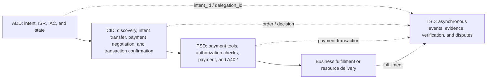

# ACT 2.1 Scenarios and Business Flows

[中文](scenarios.md) | English

> **Status: ACT 2.1 Informative Scenario Guide / Non-normative**
> **For understanding cross-domain composition. This is not an independent protocol component, an implementation specification, or conformance evidence.**
> **Version baseline: 2026-08-11 (UTC+8).**
> **Translation status: Official English translation / Informative. If a translation discrepancy is found, the Chinese ACT 2.1 publication remains controlling until the translation is corrected in a subsequent repository release.**

This guide combines ADD, CID, PSD, and TSD into end-to-end business scenarios. It helps developers decide when an IAC is required, which payment-authorization level applies, and when trustworthy events are created asynchronously. This document is the versioned ACT 2.1 scenario guide in this release. The [Scenarios and Business Flows](https://www.act-protocol.com/documentation/scenarios) page on the ACT Protocol website is an unversioned informative reference and does not override this release.

ACT 2.1 explicitly includes L1/L2/L3 in its scenario classification and component list and includes `PSD-PAY-A402`. This guide is consistent with the [Payment Services Domain](payment-services.en.md): A402 is an independent access component usable by INS, DEL, and AUP, not a new authorization level. If this guide conflicts with a domain specification, the domain specification controls.

## 1. Select the authorization scenario first

| Scenario | User present during execution | Authorization basis | PSD scenario | Common account form |
|---|---|---|---|---|
| 1. Real-time, user-present instant payment | Yes | User confirmation before funds processing for this payment | `PSD-PAY-INS` / L1 | Bound payment tool |
| 2. Directed delegation for a platform or multi-tenant Agent | No | `SPECIFIED` IAC plus verified binding between the Agent and the concrete delegator | `PSD-PAY-DEL` / L2 | Bound tool or optional sub-account |
| 3. Directed delegation for a user-dedicated Agent | No | `SPECIFIED` IAC bound to one unique dedicated Agent identity | `PSD-PAY-DEL` / L2 | Optional `PSD-AGT-SUB` |
| 4. Autonomous delegated payment | No | `BOUNDED` IAC; multiple payments may occur during the task | `PSD-PAY-AUP` / L3 | Isolated account commonly recommended, but not protocol-mandatory |

HTTP 402 is not a fifth authorization level. `PSD-PAY-A402` presents payment requirements, retries with Proof, validates credentials, and delivers resources. INS/DEL/AUP determine who authorizes, when confirmation occurs, and which boundaries the PSP must validate.

## 2. Responsibilities of the four domains in one business chain

TSD reporting is an asynchronous, non-blocking supplemental flow. Incomplete TSD reporting SHOULD NOT stop an online payment that has already satisfied ADD/CID/PSD conditions. Conversely, a failed business or payment flow MUST NOT fabricate a completion event.

## 3. Scenario one: user-present instant payment

### 3.1 Flow

1. The Agent uses `ADD-INT-ICS` to capture and structure the current purchase intent. This scenario does not require a pre-issued IAC.
2. The Agent uses `CID-MER-CAT` / `CID-INT-XFR` to discover candidates, compares them locally, and presents the product or service, amount, currency, and counterparty to the user.
3. The user confirms the transaction. The parties MAY align payment capabilities through `CID-PCA-NEG` and form an order transaction number and confirmation result through `CID-CART-CFM`.
4. The Agent initiates `PSD-PAY-INS`. The PSP checks replay protection, Agent signature, payment tool, and identity binding, and obtains user confirmation for this payment before funds processing.
5. The PSP returns the payment result. When A402 is used, the Agent retries the original resource request with `Payment-Proof`, and the seller validates it before delivery.
6. Payment and fulfillment completion events MAY enter TSD asynchronously.

### 3.2 Critical boundaries

- User confirmation of transaction content and PSP confirmation before funds processing MUST refer to the same order, amount, currency, and payee.
- A402 resource retry occurs after the payment result and is not a substitute for `PSD-PAY-INS` authorization.
- `act:payment:transaction-completed` MAY be reported after payment. `act:commerce:fulfillment-completed` can be reported only after actual fulfillment.

## 4. Scenario two: directed delegation for a platform or multi-tenant Agent

### 4.1 Establish delegation

1. The Agent captures an explicit purchase target and creates a `SPECIFIED` ISR.
2. After user confirmation, `ADD-IAC-ISS` issues an IAC. The IAC SHOULD identify the concrete delegator, delegated Agent, target boundary, amount, validity period, and permitted payment methods.
3. A platform Agent MUST be able to prove the binding between the current runtime or tenant context and the concrete delegator in the IAC. A general platform Agent identity alone MUST NOT represent an arbitrary user.
4. After the IAC becomes active, `act:delegation:delegation-issued` MAY be reported asynchronously.

### 4.2 Selection, confirmation, and payment

1. The Agent discovers candidates and decides locally. It MAY asynchronously record `act:commerce:decision-logged`.
2. `CID-CART-CFM` performs preflight validation of per-payment and cumulative amounts, merchant, category, payment method, and price deviation, then creates an order confirmation. It MAY asynchronously record `act:commerce:cart-confirmed`.
3. The Agent locally checks the IAC and payment tool, then constructs a `PSD-PAY-DEL` request containing the complete IAC, `delegation_id`, and order transaction number.
4. The PSP authoritatively validates replay protection, Agent signature, IAC signature, state and delegate, delegator or payment-tool binding, and consistency of order, amount, and authorization boundaries. Local checks cannot replace PSP checks.
5. After successful payment, fulfillment proceeds through A402 or a conventional order interface. Payment and fulfillment become separate events.

## 5. Scenario three: directed delegation for a user-dedicated Agent

Scenario three reuses the `SPECIFIED` IAC, transaction confirmation, and `PSD-PAY-DEL` flow from scenario two, with these differences:

- the Agent is bound to one user's device, account, or controlled runtime and has a unique, verifiable Agent identity;
- `agent_id` in the IAC identifies that dedicated identity, and the PSP validates its signature using the corresponding public key or trusted identity material;
- `PSD-AGT-SUB` MAY isolate balance, limits, and keys. Without a sub-account, payment-tool binding, limits, and risk control MUST provide equivalent boundaries.

A “dedicated Agent” is not inherently trustworthy and does not permit skipping IAC state, order consistency, replay protection, signatures, or payment-tool checks.

## 6. Scenario four: autonomous delegated payment

### 6.1 Authorization and task decomposition

1. The user confirms the task goal, total budget, time, permitted services, merchants, categories and payment methods, and exception-handling boundaries.
2. `ADD-IAC-ISS` issues a `BOUNDED` IAC. A dedicated sub-account MAY provide funds isolation when necessary, but the source describes it only as common or recommended, not as an AUP requirement.
3. The Agent decomposes the task locally and discovers multiple service providers. Reasoning and planning algorithms are outside ACT.

### 6.2 Every sub-payment

1. The Agent MAY use `CID-PCA-NEG` to select an available payment method.
2. Before each payment, it checks the IAC validity window, cumulative budget, per-payment amount, provider or category, payment method, and current account state.
3. A paid service MAY return HTTP 402. The Agent uses `Payment-Needed` and its completed AUP authorization decision to construct the payment request.
4. The PSP authoritatively validates replay protection, Agent and IAC signatures and state, amount and cumulative budget, provider, category and method, and any sub-account in use.
5. On success, the PSP produces a payment result or Proof. The seller MUST validate the Proof, transaction state, and original-request correlation before delivery.
6. Repeat the flow for later subtasks. The Agent updates cumulative budget only from authoritative PSP success results.

### 6.3 Task completion

After the task completes or terminates, the Agent MAY request IAC revocation. IAC revocation and expiration trigger their respective TSD events. Each payment, resource delivery, and final fulfillment remains a distinct fact. “Task complete” MUST NOT backfill a payment or delivery that did not occur.

## 7. Cross-domain correlation and recovery invariants

An end-to-end chain SHOULD at least correlate:

- ADD `intent_id`, the delegated scenario's `delegation_id`, and IAC state;
- CID requests, candidates, transaction confirmation, merchant order, and payment-capability result;
- PSD payment request, merchant order or resource, payment transaction number, Proof, and validation result;
- TSD unique attestation-record identifier and optional upstream-record reference.

Recovery MUST distinguish retrieving candidates again, confirming the transaction again, initiating a new payment, querying an unknown payment result, retrying the original resource with Proof, validating Proof again, and retrying fulfillment confirmation. If the payment result is unknown, query authoritative state first; do not automatically create a second payment. Valid Proof does not bypass resource or order consistency or duplicate-delivery protection.

## 8. Developer adoption guidance

- For a first real product integration, prioritize L1: `ADD-INT-ICS + CID-CART-CFM + PSD-PMT-BND + PSD-PAY-INS + PSD-PAY-A402`.
- Before implementing L2/L3, provide IAC issuance, state queries, Agent identity and keys, authoritative PSP authorization validation, and complete exception recovery. Adding only `delegation_id` to a request is insufficient.
- TSD normative semantics are final, but this repository does not include a runnable ACT Trust Chain or credit service. Product logs and sandbox evidence MAY become input to a future mapping but do not establish that TSD has been implemented.

## 9. Sources

- Scenario source: [Scenarios and Business Flows](https://www.act-protocol.com/documentation/scenarios)
- ADD: [Authorization & Delegation Domain](https://www.act-protocol.com/documentation/delegation)
- CID: [Commerce Interaction Domain](https://www.act-protocol.com/documentation/commerce)
- PSD: [Payment Services Domain](https://www.act-protocol.com/documentation/payment)
- TSD: [Trust Services Domain](https://www.act-protocol.com/documentation/trust)
