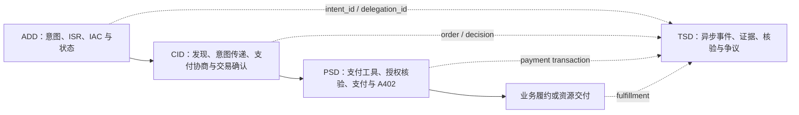

# ACT 2.1 典型场景与业务流程

中文 | [English](scenarios.en.md)

> **状态：ACT 2.1 Informative Scenario Guide / Non-normative**
> **用于理解跨域组合，不是独立协议组件、正式实现规范或 Conformance 证据。**
> **版本基线：2026-08-11（UTC+8）。**

本文把 ADD、CID、PSD 和 TSD 组合成端到端业务场景，帮助开发者判断何时需要 IAC、采用哪一种支付授权级别，以及何时异步形成可信事件。本 Release 中的本文是 ACT 2.1 的版本化场景指南；ACT Protocol 官网的[典型场景与业务流程](https://www.act-protocol.com/documentation/scenarios)是未版本化的信息性参考，不覆盖本 Release。

ACT 2.1 在场景分类和组件清单中明确 L1/L2/L3，并列入 `PSD-PAY-A402`。本指南与[支付服务域](payment-services.md)一致：A402 是可被 INS、DEL、AUP 引用的独立接入组件，不是新的授权等级。若场景说明与域正文发生冲突，以对应域正文为准。

## 1. 先选择授权场景

| 场景 | 用户在执行时是否在场 | 授权基础 | PSD 场景 | 常见账户形态 |
|---|---|---|---|---|
| 1. 实时在场即时支付 | 是 | 本笔资金处理前的用户确认 | `PSD-PAY-INS` / L1 | 已绑定支付工具 |
| 2. 平台/多租户 Agent 定向委托 | 否 | `SPECIFIED` IAC，并验证 Agent 与具体委托人的绑定 | `PSD-PAY-DEL` / L2 | 绑定工具或可选子账户 |
| 3. 用户专属 Agent 定向委托 | 否 | `SPECIFIED` IAC，IAC 绑定唯一专属 Agent 身份 | `PSD-PAY-DEL` / L2 | 可选 `PSD-AGT-SUB` |
| 4. 自主化委托支付 | 否 | `BOUNDED` IAC；任务周期内可发生多笔支付 | `PSD-PAY-AUP` / L3 | 通常建议隔离账户，但不是协议必备 |

HTTP 402 不是第五种授权级别。`PSD-PAY-A402` 负责提出支付要求、携 Proof 重试、验凭和交付；INS/DEL/AUP 决定谁授权、何时确认和 PSP 必须验证哪些边界。

## 2. 四域在一条业务链中的职责

TSD 上报是异步、非阻塞的附加流程。未完成 TSD 上报不应使已经满足 ADD/CID/PSD 条件的在线支付停在主链路；相反，业务或支付失败也不得伪造完成事件。

## 3. 场景一：用户在场的即时支付

### 3.1 流程

1. Agent 通过 `ADD-INT-ICS` 获取和结构化当前购买意图；本场景不需要预先签发 IAC。
2. Agent 使用 `CID-MER-CAT` / `CID-INT-XFR` 发现候选，本地比较后向用户展示商品或服务、金额、币种和交易对手。
3. 用户确认交易；双方可通过 `CID-PCA-NEG` 对齐支付能力，并通过 `CID-CART-CFM` 形成订单交易号和确认结果。
4. Agent 发起 `PSD-PAY-INS`；PSP 检查防重放、Agent 签名、支付工具及身份绑定，并在资金处理前取得本笔用户确认。
5. PSP 返回支付结果；采用 A402 时，Agent 携 `Payment-Proof` 重试原资源请求，卖方验凭后交付。
6. 支付与履约完成事件可以异步进入 TSD。

### 3.2 关键边界

- 用户确认交易内容与 PSP 的资金处理前确认必须围绕同一订单、金额、币种和收款方。
- A402 的资源重试发生在支付结果之后，不是 `PSD-PAY-INS` 的授权替代。
- 可以上报 `act:payment:transaction-completed`；只有实际履约完成后才能上报 `act:commerce:fulfillment-completed`。

## 4. 场景二：平台或多租户 Agent 的定向委托

### 4.1 建立委托

1. Agent 获取明确购买目标，生成 `SPECIFIED` ISR。
2. 用户确认后，`ADD-IAC-ISS` 签发 IAC；IAC 应能识别具体委托人、受托 Agent、目标边界、金额、有效期和允许的支付方式。
3. 平台型 Agent 必须能证明当前运行实例/租户上下文与 IAC 中具体委托人的绑定，不能仅凭平台的通用 Agent 身份代表任意用户。
4. IAC 生效后可异步上报 `act:delegation:delegation-issued`。

### 4.2 选择、确认和支付

1. Agent 发现候选并在本地决策；可以异步记录 `act:commerce:decision-logged`。
2. `CID-CART-CFM` 对单笔/累计金额、商户、类目、支付方式和价格偏差执行前置检验，形成订单确认；可以异步记录 `act:commerce:cart-confirmed`。
3. Agent 本地检查 IAC 和支付工具，再构造 `PSD-PAY-DEL` 请求，携带完整 IAC、`delegation_id` 和订单交易号。
4. PSP 权威验证请求防重放、Agent 签名、IAC 签名/状态/受托方、委托人或支付工具绑定、订单/金额与授权边界；本地检查不能替代 PSP 检查。
5. 支付成功后按 A402 或传统订单接口履约；支付与履约事件分别形成。

## 5. 场景三：用户专属 Agent 的定向委托

场景三沿用场景二的 `SPECIFIED` IAC、交易确认和 `PSD-PAY-DEL` 流程，区别在于：

- Agent 与单一用户的设备、账号或受控运行环境绑定，并具有唯一、可验证的 Agent 身份；
- IAC 中的 `agent_id` 指向该专属身份，PSP 使用对应公钥或受信身份材料验签；
- 可以使用 `PSD-AGT-SUB` 隔离余额、额度和密钥；若不使用子账户，也必须由支付工具绑定、额度和风控提供等价边界。

“专属 Agent”不意味着天然可信，也不意味着可以跳过 IAC 状态、订单一致性、防重放、签名或支付工具检查。

## 6. 场景四：自主化委托支付

### 6.1 授权和任务分解

1. 用户确认任务目标、总预算、时间、允许的服务/商户/类目/支付方法和异常处理边界。
2. `ADD-IAC-ISS` 签发 `BOUNDED` IAC；必要时准备专属子账户作为资金隔离，但来源只将其描述为常见/推荐做法，不构成 AUP 强制条件。
3. Agent 在本地拆解任务并发现多个服务提供方；推理和规划算法不属于 ACT。

### 6.2 每一笔子支付

1. Agent 可通过 `CID-PCA-NEG` 选择当前可用支付方法。
2. 每笔支付前检查 IAC 时间窗、累计预算、单笔金额、服务方/类目、支付方式和当前账户状态。
3. 收费服务可返回 HTTP 402；Agent 根据 `Payment-Needed` 和已完成的 AUP 授权判断构造支付请求。
4. PSP 权威验证防重放、Agent/IAC 签名和状态、金额与累计预算、服务方/类目/方法，以及按需使用的子账户。
5. 成功后形成支付结果/Proof；卖方必须验证 Proof、交易状态和原请求关联后才交付。
6. 对后续子任务重复上述流程。Agent 只以 PSP 权威成功结果更新累计预算。

### 6.3 任务结束

任务完成或终止后，Agent 可以请求吊销 IAC；IAC 吊销或到期分别触发相应 TSD 事件。每笔支付、资源交付和最终履约仍是不同事实，不能用“任务完成”回填未发生的支付或交付。

## 7. 跨域关联和恢复不变量

一条端到端链路至少应能关联：

- ADD 的 `intent_id`，委托场景中的 `delegation_id` 和 IAC 状态；
- CID 的请求、候选、交易确认、商户订单和支付能力结果；
- PSD 的支付请求、商户订单/资源、支付交易号、Proof 和验证结果；
- TSD 的存证记录唯一标识和可选上游记录引用。

恢复时必须区分：重新获取候选、重新确认交易、重新发起支付、查询未知支付结果、携 Proof 重试原资源、重新验凭和重试履约确认。支付结果未知时先查询权威状态，不能自动创建第二笔支付；Proof 有效也不能绕过资源/订单一致性和防重复交付检查。

## 8. 开发者采用建议

- 首期真实产品接入优先实现 L1：`ADD-INT-ICS + CID-CART-CFM + PSD-PMT-BND + PSD-PAY-INS + PSD-PAY-A402`。
- 实现 L2/L3 前，需要同时具备 IAC 签发、状态查询、Agent 身份/密钥、PSP 权威授权核验和完整异常恢复，不能只在请求中增加 `delegation_id`。
- TSD 规范语义已经定稿，但本仓库没有可运行的 ACT Trust Chain 或信用服务。产品日志和沙箱证据可以作为未来映射输入，但不得据此声明已实现 TSD。

## 9. 来源

- 场景事实源：[典型场景与业务流程](https://www.act-protocol.com/documentation/scenarios)
- ADD：[委托授权域](https://www.act-protocol.com/documentation/delegation)
- CID：[商业交互域](https://www.act-protocol.com/documentation/commerce)
- PSD：[支付服务域](https://www.act-protocol.com/documentation/payment)
- TSD：[信任服务域](https://www.act-protocol.com/documentation/trust)
