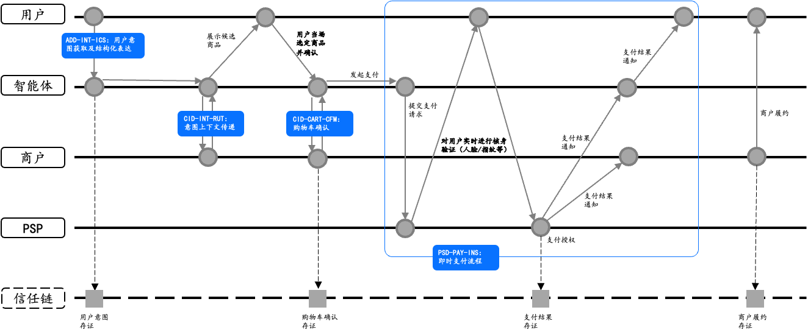
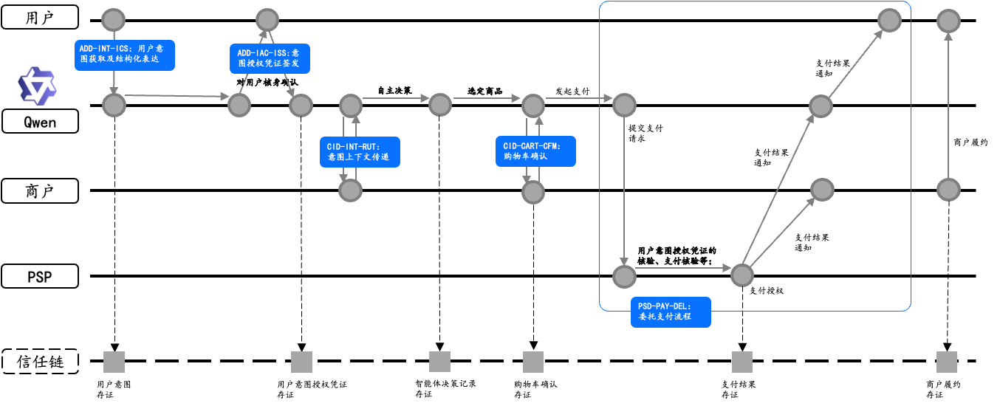
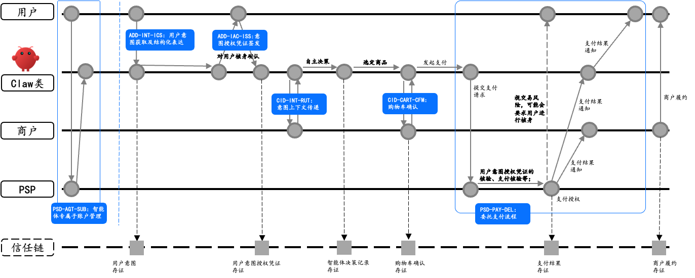
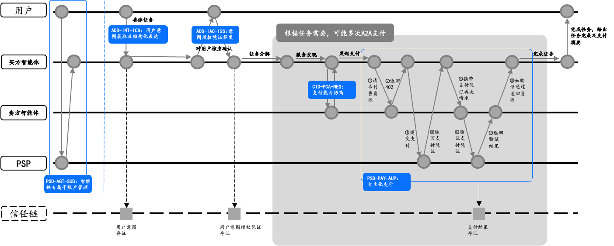

# ACT 2.1 典型场景与业务流程

中文 | [English](scenarios.en.md)

# 概述
本部分通过 ACT 协议支持的典型商业场景，说明委托授权、商业交互、支付执行与信任服务在端到端链路中的衔接关系，为协议采纳方提供场景化实施参照。本文档重点描述各场景下的适用条件、关键业务步骤与跨域接口关系。

# 场景分类框架
将智能体商业中的支付场景按委托人在场性与智能体商业决策自主度，抽象为三个级别：

+ **L1 用户即时支付**：委托人实时在场参与购买决策闭环，AI 参与意图理解与商品匹配，但资金扣划前必须完成委托人笔笔核身确认，支付决策权在委托人。该级别无需预先签发意图授权凭证（IAC），由委托人当次实时确认作为支付授权基础。
+ **L2 用户定向委托支付**：委托人不实时在场，购买标的在初始交互中已明确。委托人预先签发意图授权凭证，授权智能体在既定边界内按照明确的购买标的定向执行，执行过程中一般无需委托人逐笔再次介入。
+ **L3 自主化委托支付**：委托人不实时在场，且具体购买标的由智能体在执行过程中于授权边界内自主决定。委托人预先签发意图授权凭证，仅设定任务目标及边界条件（如总预算上限、品类范围、任务有效期限等），智能体在边界内自主完成任务拆解、服务发现、多轮协商、商业决策及多次自主化支付。

上述三级分类的核心依据是"委托人在场性"与"智能体商业决策自主度"两个维度的组合：前者区分为委托人实时在场（Human-Present）与委托人不在场（Human-Not-Present）两类；后者区分为按既定目标的定向执行，以及在授权边界内由智能体自主决策两类。L1 对应"实时在场+委托人决策"，L2 对应"不在场+定向执行"，L3 对应"不在场+自主决策"。按照上述两个维度，ACT 整理了四类典型场景，如下表所示。

| **场景** | **L级别** | **委托人在场性** | **对意图授权凭证（IAC）的依赖** | **智能体商业决策自主度** |
| --- | --- | --- | --- | --- |
| 场景一：用户即时支付 | L1 | 实时在场 | 无需预先签发 IAC | 委托人实时确认并作出关键决策 |
| 场景二：定向委托支付（平台型智能体） | L2 | 不在场 | 依赖 IAC，委托模式为 SPECIFIED | 智能体按委托人已明确的目标程序化定向执行 |
| 场景三：定向委托支付（专属型智能体） | L2 | 不在场 | 依赖 IAC，委托模式为 SPECIFIED | 智能体按委托人已明确的目标程序化定向执行 |
| 场景四：智能体自主委托支付 | L3 | 不在场 | 依赖 IAC，委托模式为 BOUNDED | 智能体在授权边界内自主开展多轮商业决策与支付 |

后续各节按场景分别说明其关键流程及差异化要求。

# ACT协议组件列表
| **所属协议域** | **协议编号** | **协议名称** | **协议描述** |
| --- | --- | --- | --- |
| 委托授权域 （Authorization & Delegation Domain, ADD）  | ADD-INT-ICS  | 意图获取与结构化表达 （Intent Capture and Structured Expression）  | 面向用户委托意图的采集、规范化与结构化表达 |
| | ADD-IAC-ISS  | 意图授权凭证签发（Intent Authorization Credential Issuance）  | 基于结构化的用户意图生成并签发 IAC 授权凭证 |
| | ADD-IAC-LCM  | 意图授权凭证生命周期管理   （Intent Authorization Credential Life Cycle Management）  | 管理 IAC 的激活、暂停、恢复、撤销与过期状态 |
| 商业交互域 （Commerce Interaction Domain, CID）   | CID-MER-CAT  | 商家目录接口 （Catalog Interface）  | 提供商品、服务与商家目录的标准化访问入口 |
| | CID-INT-XFR  | 意图上下文传递 （Intent Context Transfer）  | 将意图上下文传递给合适的商家，并获得相匹配的产品和服务推荐 |
| | CID-PCA-NEG  | 支付能力协商 （Payment Capability Negotiation）  | 用于协商可用支付方式、PSP 与支付端点等支付能力信息 |
| | CID-CART-CFM  | 购物车确认 （Cart Confirmation）  | 在支付前对订单、购物车或交易内容进行最终确认 |
| 支付服务域 （Payment Services Domain, PSD）   | PSD-PMT-BND  | 支付方式绑定 （Payment Method Binding）  | 绑定可用支付方式，为后续支付流程提供基础 |
| | PSD-AGT-SUB  | 智能体专属子账户管理（Agent-Dedicated Sub-Account Management）  | 管理面向智能体运行的专属子账户及相关支付控制能力 |
| | PSD-PAY-A402 | 基于 HTTP 402 的支付流程 | 规范买方智能体、卖方服务方与支付服务方之间基于 HTTP 402 的通用支付接入交互机制，可作为支付场景组件的统一接入入口 |
| | PSD-PAY-INS  | 用户即时支付 （Instant Payment）  | 用于实时完成支付处理并产生支付完成结果。 |
| | PSD-PAY-DEL  | 用户定向委托支付 （Delegated Payment）  | 基于意图授权凭证（SPECIFIED模式），由智能体在委托人不在场场景下发起定向委托支付并接受支付服务方核验 |
| | PSD-PAY-AUP  | 自主化委托支付（Autonomous Delegated Payment）  | 基于意图授权凭证（BOUNDED模式），由智能体在授权边界内自主开展多轮商业决策与支付 |
| 信任服务域 （Trust Services Domain, TSD）   | TSD-ATT-EVT  | 存证事件 （Attestation Event）  | 定义跨域关键行为和状态变化的存证事件记录单元 |
| | TSD-ATT-OFF  | 离线存证记录 （Offline Attestation Record）  | 形成可离线保存、传输和校验的标准化存证记录 |
| | TSD-ATT-OCA  | 链上存证锚定 （On-Chain Attestation Anchor）  | 将存证摘要锚定到 ACT Trust Chain 以增强可验证性与防篡改性 |
| | TSD-ATT-SVF  | 签名核验流程 （Signature Verification Flow）  | 定义对存证记录、摘要、链上锚定和签名的一致性校验流程 |
| | TSD-ATT-DSP  | 争议处理 （Dispute Resolution）  | 争议处理与裁决支撑 |
| | TSD-CRD-ASC | 信用关联建立（Credit Association Establishment） | 规范关联主体与智能体之间信用关联关系的建立机制与凭证签发 |
| | TSD-CRD-MAP | 关联信用映射（Associated Credit Mapping） | 规范关联主体信用声明到智能体关联信用声明的映射规则与版本管理 |
| | TSD-CRD-LCM | 信用关联生命周期管理（Credit Association Lifecycle Management） | 规范信用关联凭证的状态机及暂停、撤销、过期、重新评估等管理机制 |
| | TSD-CRD-VER | 关联信用验证（Associated Credit Verification） | 规范第三方对信用关联关系及关联信用信息的标准化验证 |
| | TSD-CRD-AUTH | 信用查询授权（Credit Query Authorization） | 规范关联主体对关联信用验证的查询授权机制 |

# 场景一：用户即时支付
## 场景描述
本场景适用于委托人实时在场，且购买标的已在当次交互中明确的即时购买情形。委托人在当次交互中实时完成商品确认与支付授权，无需预先签发 IAC。

**典型示例：** 委托人对智能体说"帮我下单这款耳机"，智能体完成商品发现后，由委托人当场确认并完成支付。

## 主要业务流程

**步骤 1：委托人表达购买意图。**
委托人以自然语言向智能体提出购买需求。

**步骤 2：意图结构化与意图确认。**
智能体可参照 ADD-INT-ICS，将自然语言意图转换为标准化的结构化约束信息，并以可读形式呈现给委托人确认。可明确的约束内容包括购买类别、金额上限、有效期、支付方式约束、履约时效要求等关键条件。

**步骤 3：商品发现或商户路由。**
智能体获取商品详情或筛选候选商品时，可参照 CID-MER-CAT 获取商户结构化商品目录，也可参照 CID-INT-XFR  向商户或平台传递意图上下文以获取更精准的候选结果。

**步骤 4：委托人实时确认商品与支付意愿。**
智能体向委托人呈现候选商品，由委托人当场选定交易对象并确认支付意愿。该步骤属于应用层内部交互，其结果将作为后续支付发起的直接前提。

**步骤 5：支付能力协商（可选）。**
智能体可参照 CID-PCA-NEG 读取商户声明的支付能力信息，以确认本次支付所采用的支付方式与支付服务方。

**步骤 6：支付发起与 PSP 核验。**
智能体应依据 PSD-PAY-INS 构造支付请求并向 PSP 发起即时支付。PSP 对支付请求进行核验，应至少包括防重放校验、智能体签名有效性验证等内容，并可根据需要发起委托人核身挑战。如核验未通过，PSP 应拒绝本次支付并返回相应错误结果；全部核验通过后，PSP 返回支付授权结果。

**步骤 7：商户履约。**
商户在确认支付授权后完成订单履约。该过程属于商户内部业务流程，不属于本协议规范范围。

**【存证】支付完成事件存证（可选）。**
实现方可对 `act:payment:transaction-completed` 事件进行异步存证。此类存证可为事后争议处理提供支付完成事实依据，也可为智能体积累可追溯的历史行为记录。

# 场景二：定向委托支付（平台型智能体）
## 场景描述
本场景适用于委托人不在场，且购买标的在初始交互中已被明确的定向委托情形。委托人需预先签发 SPECIFIED 类型的 IAC，授权平台型智能体在既定边界内完成后续商业发现、交易确认与程序化支付，执行过程中一般无需委托人再次实时介入。

平台型智能体通常采用多租户共享架构，即多个委托人共享同一平台智能体身份。因此，本场景的支付核验应同时考虑平台智能体身份与具体委托人身份之间的绑定关系，以降低跨委托人越权与身份混淆的风险。

**典型示例：** 委托人对平台型智能体说"帮我订明天上午飞北京的机票，不超过 1200 元"，完成核身与凭证签发后，由智能体在授权边界内完成查询、比价、下单与支付。

## 主要业务流程

### 阶段一：意图结构化与凭证签发
**步骤 1：委托人表达意图。**
委托人以自然语言表达购买需求。

**步骤 2：意图结构化与意图确认。**
智能体可参照 ADD-INT-ICS，将自然语言意图转换为标准化的结构化约束信息，并以可读形式呈现给委托人确认。

**步骤 3：签发 IAC。**
委托人确认意图规则后，智能体应参照 ADD-IAC-ISS，完成委托人核身并在安全环境中执行签名，委托模式应设定为 `SPECIFIED`。本步骤生成的凭证及其唯一标识，将在后续商业交互、支付执行和存证过程中持续被引用，以保持全链路信息一致性。

**【存证】凭证签发事件存证（可选）。**
IAC 签发完成后，实现方可异步提交 `act:delegation:delegation-issued` 存证事件。

### 阶段二：商业交互
**步骤 1：商品发现或商户路由。**
智能体可参照 CID-MER-CAT 获取商户结构化商品目录，也可参照 CID-INT-XFR  向商户或平台传递意图上下文。

**步骤 2：商品比较与决策。**
智能体依据结构化意图约束对候选结果进行比较，并形成购买决策。该推理过程属于应用层内部实现，但智能体可在本地生成结构化决策摘要，以便事后说明选择依据。

**【存证】智能体决策事件存证（可选）。**
实现方可异步提交 `act:commerce:decision-logged` 存证事件，为后续争议处理提供智能体决策依据。

**步骤 3：购物车确认与规则自检。**
智能体在提交购物车前，应依据 CID-CART-CFM 执行规则自检，确认本次交易符合 IAC 中定义的全部授权边界与约束条件。全部通过后，智能体提交购物车并获得订单交易号；若存在约束不满足情形，则按 IAC 中预设的边界处理策略执行，例如通知委托人重新确认或自动取消。

**【存证】购物车确认事件存证（可选）。**
购物车确认完成后，实现方可异步提交 `act:commerce:cart-confirmed` 存证事件，为后续争议处理提供交易确认依据。

### 阶段三：支付执行
**步骤 1：支付能力确认（可选）。**
智能体可参照 CID-PCA-NEG，确认本次支付所采用的支付方式与支付服务方。

**步骤 2：支付发起与 PSP 核验。**
智能体应依据 PSD-PAY-DEL 构造委托支付请求，请求中应携带 IAC 与订单交易号，并由智能体完成签名后提交给 PSP。PSP 应执行防重放校验、智能体签名验证、IAC 有效性校验、委托人身份与支付凭据一致性校验，以及订单交易参数与授权边界一致性校验。如核验未通过，PSP 应拒绝本次支付请求并返回对应错误结果；全部核验通过后，PSP 返回支付结果。

上述流程及示意图采用传统商户平台下单支付流程进行描述；买方智能体也可采用 PSD-PAY-A402 支付流程发起支付。

**【存证】支付完成事件存证（可选）。**
支付完成后，实现方可异步提交 `act:payment:transaction-completed` 存证事件，为后续争议处理提供支付事实依据。

**步骤 3：商户履约。**
商户在确认支付授权后完成履约。该过程属于商户内部业务流程，不属于本协议规范范围。

**【存证】履约完成事件存证（可选）。**
商户履约后，实现方可异步提交 `act:commerce:fulfillment-completed` 存证事件，为后续争议处理提供履约状态依据。

# 场景三：定向委托支付（专属型智能体）
## 场景描述
本场景同样适用于委托人不在场、购买标的已在初始交互中明确的定向委托情形，但执行主体为与委托人设备、账号或运行环境强绑定的专属型智能体。

与场景二的多租户平台型智能体不同，专属型智能体拥有独立且唯一的专属身份，支付核验可直接锚定该专属智能体身份进行验证。在满足支付服务方能力条件时，本场景还可支持为专属型智能体设立独立子账户，以实现智能体支付行为与委托人主账户之间的风险隔离。

**典型示例：** 委托人通过自己的专属智能体说"帮我买《人工智能：现代方法》这本书，不超过 150 元"，完成核身与凭证签发后，由专属智能体完成查询、比价、下单与支付。

## 主要业务流程

本场景在意图结构化与凭证签发、商业交互、购物车确认、委托支付执行及异步存证等基础流程上，与场景二总体一致，本节不再重复展开。以下仅对其与场景二存在实质差异的部分作重点说明。

**差异点一：专属智能体身份初始化**

当专属型智能体首次与委托人设备或运行环境建立安全绑定关系时，应向身份相关服务完成注册与验证，获得在 ACT 生态中可被识别和核验的唯一身份标识。此初始化操作通常仅在首次绑定时执行一次；后续同一专属智能体再次发起商业委托时，可直接复用既有身份。

**差异点二：IAC 中受托方标识及签名校验方式**

在本场景中，IAC 的受托方标识应填写专属智能体的唯一智能体标识。PSP 在核验支付请求时，应基于该 Agent ID 所对应的公钥材料，对发起支付请求的智能体签名进行验证。

**差异点三：专属子账户支持**

若委托人为专属型智能体启用了独立子账户，则智能体与支付服务方可参照 PSD-AGT-SUB 完成专属子账户的建立、标识绑定及生命周期管理；在具体支付时，支付请求中应携带相应子账户标识，PSP 在核验阶段应同时验证子账户余额或额度状态，并按规则完成扣款或额度冻结。若未启用独立子账户，也可基于支付凭据区分与风险控制机制完成交易处理。

# 场景四：智能体自主委托支付
## 场景描述
本场景适用于委托人不在场，且具体购买标的由智能体在执行过程中于授权边界内自主决定的情形。与场景二、三中的定向委托不同，委托人无需在初始阶段明确指定具体交易对象，只需设定任务目标及边界条件，例如总预算上限、服务品类范围、任务有效期限等。在该授权边界内，智能体可自主完成任务拆解、服务发现、多轮协商及多次自主化支付，全程无需委托人逐笔介入。

为控制机器间高频交易风险，本场景通常要求买方智能体使用专属独立子账户，以实现与委托人主账户的风险隔离。

**典型示例：** 委托人要求专属智能体撰写一份研报，智能体自主依次向数据服务智能体、文献检索智能体等购买能力或数据，并在全部子任务完成后向委托人交付结果。

## 主要业务流程

### 阶段一：任务委托与凭证签发
**步骤 1：委托人表达自主委托任务。**
委托人向买方智能体表达任务目标及边界约束，例如服务类别范围、总预算上限和任务截止时间等。

**步骤 2：结构化意图与规则确认。**
买方智能体可参照 ADD-INT-ICS 对任务目标和约束进行结构化表达，并将关键约束内容呈现给委托人确认。

**步骤 3：签发自主委托 IAC。**
委托人确认后，买方智能体应参照 ADD-IAC-ISS 完成核身与签名，委托模式应设定为 `BOUNDED`。凭证签发完成后，后续买方智能体在边界内发起的多轮自主化支付一般无需委托人逐笔再次确认。

**步骤 4：专属子账户准备（可选）。**
买方智能体检查专属独立子账户的余额或可用额度状态；如不足，可提醒委托人补充资金或调整预算上限。

**【存证】凭证签发事件存证（可选）。**
IAC 签发完成后，实现方可异步提交 `act:delegation:delegation-issued` 存证事件。

### 阶段二：任务拆解与服务发现
**步骤 1：任务拆解。**
买方智能体将整体任务拆解为若干子任务，并规划执行路径。该过程属于智能体内部推理，不属于本协议规范范围。

**步骤 2：服务发现。**
买方智能体可通过服务市场或其他发现机制，筛选符合意图约束条件的服务方智能体，并形成候选列表。在筛选服务方智能体时，买方智能体可按需引用信任服务域的智能体关联信用声明（参照信用关联子篇）作为服务方信任评估的辅助参考输入。

**步骤 3：支付能力协商（可选）。**
买方智能体可参照 CID-PCA-NEG，与选定的服务方智能体完成支付能力协商，确认匹配的支付方式与支付服务方。

### 阶段三：多轮智能体对智能体自主化支付
以下流程描述单次自主化支付过程；在一个完整任务执行周期内，该过程可循环发生多次。

**步骤 1：规则实时自检。**
每次发起自主化支付前，买方智能体应验证：当前时间是否在凭证有效期内、累计支付金额与本次金额之和是否超出总额上限、服务提供方及服务类别是否满足约束，以及支付方式是否在授权范围内。任一条件不满足时，智能体应终止本次支付，并按预设策略处理。当剩余额度或有效期接近预设阈值时，智能体可主动向委托人发送预警。

**步骤 2：支付触发与报文构造。**
服务方智能体在收到买方智能体的服务请求后，可通过返回 `HTTP 402 Payment Required` 的方式提出支付要求（参照 PSD-PAY-A402），并在响应中说明本次服务对应的支付金额、支付方式、收款方标识及其他必要支付参数。买方智能体在接收到该支付要求后，依据 PSD-PAY-AUP 构造本次自主化委托支付请求报文，携带 BOUNDED 模式 IAC 及本次支付参数，并完成签名。该支付请求报文应由买方智能体直接提交至约定的 PSP，用于申请本次服务对应的支付授权。

上述流程及示意图采用 PSD-PAY-A402 支付流程进行描述；买方智能体也可基于传统商户平台下单支付流程发起支付。

**步骤 3：PSP 核验与支付授权。**
PSP 在收到支付请求后，依据 PSD-PAY-AUP 执行自主化委托支付的场景核验，包括防重放校验、买方智能体签名验证、BOUNDED 模式 IAC 有效性核验、本次金额与累计额度边界核验，以及专属子账户余额或可用额度核验。

上述核验要求与支付接入方式相互独立，无论采用 PSD-PAY-A402 还是传统商户平台下单支付流程，PSP 均应完成上述场景核验。如核验未通过，PSP 应拒绝本次支付，并向买方智能体返回失败结果或对应错误信息。如全部核验通过，PSP 应返回支付成功结果，或返回可供后续服务交付阶段引用和校验的支付授权结果及凭证。买方智能体在获得支付成功结果后，方可进入后续服务请求阶段。

**步骤 4：服务交付与子任务继续。**
服务方智能体在收到买方智能体再次发起的服务请求后，应对请求中携带的支付结果、支付凭证或支付相关标识进行校验，并按照与支付服务方约定的校验方式向支付服务方核验本次支付状态，以确认该请求所对应的支付已完成，或者相关支付授权处于有效状态。仅在确认支付已完成，或者确认相关支付授权有效且可接受后，服务方智能体方可交付相应数据或服务结果。

买方智能体继续执行下一子任务，直至全部子任务完成。

**【存证】单次支付完成事件存证（可选）。**
每次自主化支付完成后，实现方可异步提交 `act:payment:transaction-completed` 存证事件。同一委托任务下的多笔支付记录，可进一步聚合形成完整的任务账单，以支持任务完成后的审计和争议处理。

### 阶段四：任务完成与账单回溯
**步骤 1：任务完成与结果交付。**
所有子任务完成后，买方智能体汇总结果并向委托人交付任务输出。

**步骤 2：凭证吊销（可选）。**
若任务完成时凭证尚未过期，买方智能体可参照 ADD-IAC-LCM 主动触发凭证吊销，以终止后续可能的支付行为。

**步骤 3：账单回溯。**
委托人可查看本次任务执行过程中买方智能体发起的全部支付记录及相关结果摘要。

**【存证】凭证吊销或过期事件存证（可选）。**
若凭证被主动吊销，实现方可异步提交 `act:delegation:delegation-revoked` 存证事件；若凭证因到期而失效，可异步提交 `act:delegation:delegation-expired` 存证事件。

# 存证异步处理通用说明
本文档各场景中标注为【存证】的步骤，均为异步非阻塞操作，其执行时序不应阻塞或影响商业交互与支付主流程的正常推进。

是否提交相关存证事件，以及由哪一参与方负责提交，可根据业务风险等级、争议处理要求及实现架构作具体安排。但对于已经提交的存证事件，其事件类型、载荷结构、签名校验方式及后续核验规则，应符合信任服务域的统一规定。

在协议当前版本中，典型可存证的事件包括凭证签发、智能体决策记录、购物车确认、支付完成、履约完成以及凭证吊销或过期等。这些事件共同构成后续争议处理、审计和事后追溯的重要事实基础。
