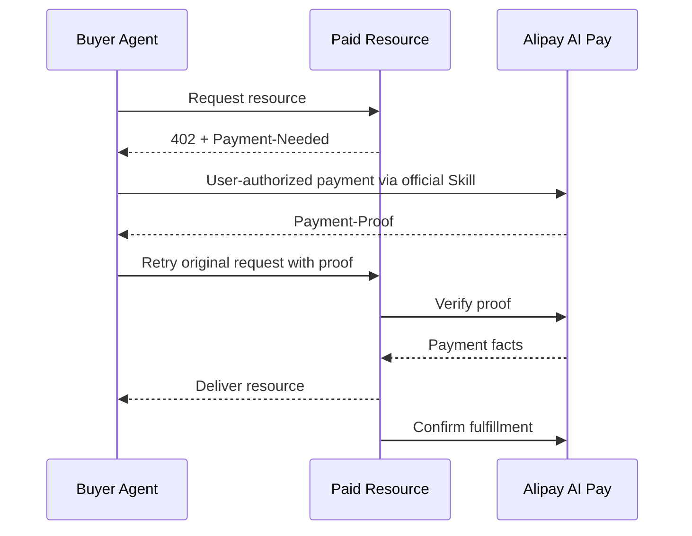

# Alipay AI Pay Profile

> Status: Preview / Non-normative  
> Profile version: `0.1-working-draft`  
> Product source snapshot: 2026-07-16  
> Compatible ACT version: pending ACT Core 2.1 revision

This directory records how the public Alipay AI Pay products relate to ACT working semantics. It is an alignment workspace for the July Preview, not a published ACT Product Profile.

## Scope

The first preview covers two product paths:

| Product path | Participant | Public integration baseline |
|---|---|---|
| Agent Payment | Buyer Agent | Official Alipay wallet and payment Skill/CLI |
| AI Metered Payment | Paid resource provider | HTTP 402, `Payment-Needed`, `Payment-Proof`, payment verification and fulfillment confirmation |

The two paths form one payment loop:

## Documents

| Document | Purpose |
|---|---|
| [Official sources](official-sources.md) | Public product sources and snapshot policy |
| [Agent Payment alignment](agent-payment-alignment.md) | Wallet, Skill/CLI and buyer payment path |
| [Metered Payment alignment](metered-payment-alignment.md) | HTTP 402 provider path |
| [Field mapping](field-mapping.md) | Working ACT-to-Alipay field mapping |
| [Lifecycle mapping](lifecycle-mapping.md) | Product events and working ACT states |
| [Error mapping](error-mapping.md) | Product errors and candidate recovery actions |

## Layer boundary

| Layer | Owns | Must not own |
|---|---|---|
| ACT Core | Cross-product meaning, lifecycle, verification responsibility, recovery semantics | Alipay API names, merchant identifiers, RSA2 details |
| Alipay AI Pay Profile | Product fields, API calls, Skill/CLI capabilities, signatures and product error mapping | Redefinition of Core semantics |
| Binding | HTTP Header or Skill/CLI packaging and transport behavior | Product onboarding policy |
| Official product documentation | Onboarding, credentials, sandbox operation and current product procedures | ACT protocol definitions |

## Status labels

| Label | Meaning |
|---|---|
| `PUBLIC-FACT` | Directly supported by a public Alipay source |
| `PRODUCT-REVIEW` | Interpretation of public material that needs Alipay product confirmation |
| `PROTOCOL-PENDING` | Depends on the ACT Core revision led by the protocol owner |
| `VALIDATION-PENDING` | Must be verified with the official sandbox or Skill/CLI |

## Compatibility statement

An implementation cannot claim conformance to this working draft. Conference release conformance will require:

1. a reviewed ACT Core candidate;
2. a versioned Alipay AI Pay Profile;
3. a declared Binding;
4. successful profile tests using the official public integration path.
