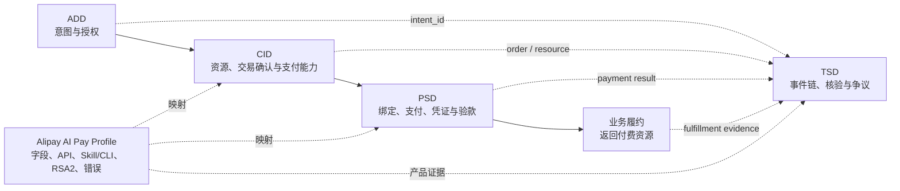

# Alipay AI Pay 双侧能力与 ACT 四域映射

> 状态：July Preview / Non-normative  
> 映射基线：ACT 官网四域框架 + 支付宝 AI 付公开产品  
> 用途：说明机器支付闭环的买卖双方能力如何组合 ACT 域，不定义或修改 ACT 正式协议

## 1. 先理解映射关系

Agent 支付和 AI 按量付费不是两套孤立流程。它们共同组成支付宝 AI 付的机器支付闭环：

- Agent 支付是**买方 Agent 支付能力**，负责授权、支付执行和支付凭证获取。
- AI 按量付费是**卖方机器支付能力**，负责机器可读出账、支付凭证验证、资源交付和履约确认。

两侧能力都不是一个新的 ACT 域，也不能各自与某一个域一一对应。Alipay AI Pay Profile 复用 ACT 四域的跨产品语义，再补充支付宝字段、接口、签名、Skill/CLI 和产品错误，使双方可以在同一交易上下文中互操作。

ACT 官网当前按照四个域组织：

| ACT 域 | 官网组件 | 在支付旅程中回答的问题 |
|---|---|---|
| [ADD：Authorization & Delegation Domain](https://www.act-protocol.com/documentation/delegation) | `ADD-INT-ICS`、`ADD-IAC-ISS`、`ADD-IAC-LCM` | 用户想做什么；Agent 是否得到足够授权；授权何时失效 |
| [CID：Commerce Interaction Domain](https://www.act-protocol.com/documentation/commerce) | `CID-MER-CAT`、`CID-INT-XFR`、`CID-PCA-NEG`、`CID-CART-CFM` | 买什么；向谁买；价格和订单是什么；双方能使用哪种支付能力 |
| [PSD：Payment Services Domain](https://www.act-protocol.com/documentation/payment) | `PSD-PMT-BND`、`PSD-AGT-SUB`、`PSD-PAY-INS`、`PSD-PAY-DEL`、`PSD-PAY-AUP` | 支付方式如何可用；以何种授权级别发起、证明和验证支付 |
| [TSD：Trust Services Domain](https://www.act-protocol.com/documentation/trust) | `TSD-ATT-EVT`、`TSD-ATT-OFF`、`TSD-ATT-OCA`、`TSD-ATT-SVF`、`TSD-ATT-DSP` | 如何形成可验证事件链、存证、核验和争议处理 |

因此，开发者的阅读顺序应当是：先确认自己在闭环中建设买方还是卖方能力，再用本页确认其覆盖哪些 ACT 组件，最后进入支付宝官网完成真实产品接入。需要声明端到端兼容时，必须同时验证两侧能力。

## 2. 双侧能力与四域总览

| 能力侧 | ADD | CID | PSD | TSD |
|---|---|---|---|---|
| 买方 Agent 支付能力 | 捕获支付意图；未来委托模式使用 IAC | 消费商品、订单和卖方支付能力信息 | 钱包绑定；首期用户确认支付；未来委托/自主支付 | 产生意图和支付证据，并与订单、履约关联 |
| 卖方机器支付能力 | 消费买方上游授权上下文，本身不签发用户授权 | 发布收费资源、价格、订单和支持的支付方式 | 用 402 出账、接收凭证、验款和确认履约 | 产生支付验证和履约证据，支持后续核验 |

这个表描述职责覆盖，不表示支付宝产品实现了 ACT 官网每个组件的完整标准接口。具体状态使用以下标签：

- `CURRENT`：首期公开接入基线必须覆盖。
- `HOST`：由承载 Agent 或商户业务提供，支付宝支付产品只消费其结果。
- `FUTURE`：对应 L2/L3 或后续公开接入形态，首期不声明支持。
- `PROTOCOL-PENDING`：需要协议修订负责人确认边界。

## 3. 买方 Agent 支付能力映射

首期公开基线按“用户在场并明确确认单笔支付”建模。支付宝官方 Skill/CLI 是产品接入载体，不替代 Agent 对意图、商品和任务上下文的管理。

| ACT 域/组件 | 支付宝产品或宿主行为 | 状态 | 边界说明 |
|---|---|---|---|
| `ADD-INT-ICS` | Agent 展示收款方、金额、交易对象并取得用户确认 | `HOST` | 支付 Skill 消费支付意图；原始任务意图由宿主 Agent 捕获 |
| `ADD-IAC-ISS` / `ADD-IAC-LCM` | 长期额度、指定意图委托或自主授权 | `FUTURE` | 首期单笔确认路径不要求 Agent 自行签发 IAC |
| `CID-MER-CAT` | 商户 Skill、API、MCP Tool 或业务 Agent 提供商品/服务 | `HOST` | 支付 Skill 不负责商品目录 |
| `CID-INT-XFR` | Agent 将必要购买上下文交给商户或收费资源 | `HOST` | 只传完成交易所需的最小上下文 |
| `CID-PCA-NEG` | 识别对方支持支付宝，并选择官方支付能力 | `CURRENT` / `PROTOCOL-PENDING` | 当前 Skill 或 402 可隐式完成选择；标准能力声明格式待修订 |
| `CID-CART-CFM` | 宿主业务确认商品、金额、商户订单与收款方 | `HOST` | 支付前必须存在可理解的交易确认结果 |
| `PSD-PMT-BND` | 支付宝 AI 钱包开通、授权绑定、状态检查和解绑 | `CURRENT` | 产品操作以[钱包指南](https://aipay.alipay.com/wallet-guide)为准 |
| `PSD-PAY-INS` | 用户确认后由官方 Payment Skill 提交支付并查询结果 | `CURRENT` | 首期主要支付执行语义 |
| `PSD-PAY-DEL` | 基于指定意图授权、用户不在场的支付 | `FUTURE` | 需要 IAC 与公开产品能力共同确认 |
| `PSD-AGT-SUB` / `PSD-PAY-AUP` | 受限自主支付及其账户隔离能力 | `FUTURE` | 不作为首期公开 Skill/CLI 的合规声明 |
| `TSD-ATT-EVT` 等 | 将支付结果与意图、订单和履约证据关联 | `PROTOCOL-PENDING` | 支付宝交易记录是产品证据，不自动等同于 ACT TSD 事件记录 |

### 3.1 为什么 Agent 支付会遇到 402，但仍以 `PSD-PAY-INS` 为主？

HTTP 402 描述资源服务如何提出支付要求、买方如何携带凭证重试，是支付交互框架；`PSD-PAY-INS`、`PSD-PAY-DEL` 和 `PSD-PAY-AUP` 描述授权和执行级别。首期 Agent 支付即使消费 402 账单，仍由用户逐笔确认，因此支付执行按 `PSD-PAY-INS` 建模。

ACT 官网当前把完整 402 `Payment-Needed` / `Payment-Proof` / `Payment-Validation` 框架放在 `PSD-PAY-AUP`。框架能否被 `PSD-PAY-INS` 和 `PSD-PAY-DEL` 共用，需要在本轮协议修订中明确，当前标记为 `PROTOCOL-PENDING`。

## 4. 卖方机器支付能力映射

AI 按量付费让收费资源具备接受机器支付的能力。它负责生成支付要求、验证支付凭证、交付资源和确认履约，不负责替买方 Agent 决定是否有权支付。

| ACT 域/组件 | 支付宝产品或宿主行为 | 状态 | 边界说明 |
|---|---|---|---|
| `ADD-INT-ICS` | 买方 Agent 捕获购买意图 | `HOST` | 卖方资源只消费完成交易所需的上下文 |
| `ADD-IAC-ISS` / `ADD-IAC-LCM` | 买方 Agent 的委托凭证及其状态 | `HOST` / `FUTURE` | 卖方产品不替用户签发授权 |
| `CID-MER-CAT` | API、MCP Tool、Skill、数字内容或算力的服务描述 | `CURRENT` | 产品注册信息可作为 Profile 映射输入，但不等同于完整 ACT Catalog |
| `CID-INT-XFR` | 原始资源请求及必要业务上下文 | `CURRENT` | 支付后必须恢复同一个资源请求 |
| `CID-PCA-NEG` | 服务声明支付宝支付方式，Agent 选择可用方式 | `CURRENT` / `PROTOCOL-PENDING` | 402 中的产品方法字段需要映射到 ACT 支付能力描述 |
| `CID-CART-CFM` | 确认资源、金额、币种、商户订单和收款方 | `CURRENT` / `PROTOCOL-PENDING` | `Payment-Needed` 是否可承载完整交易确认结果待协议确认 |
| `PSD-PAY-AUP` 基础框架 | `402 Payment Required`、`Payment-Needed`、`Payment-Proof`、验款和交付 | `CURRENT` | 支付宝字段与 RSA2 规则属于 Alipay Profile 和 HTTP Binding |
| 支付方式扩展 | `alipay.aipay.agent.payment.verify` 及支付宝支付字段 | `CURRENT` | 实现必须调用官网接口并核对原账单，而不是本地相信 Proof |
| 履约确认 | `alipay.aipay.agent.fulfillment.confirm` | `CURRENT` / `PROTOCOL-PENDING` | 它是支付宝产品回调；与 ACT 支付回执、TSD 事件的关系待确认 |
| `TSD-ATT-EVT` 等 | 支付完成、履约完成及关联证据 | `PROTOCOL-PENDING` | 产品日志或履约确认调用本身不自动构成 TSD 合规记录 |

卖方的真实产品步骤始终以[支付宝 AI 按量付费接入指南](https://aipay.alipay.com/docs/ai-receive/MACHINE_PAY.html)为准。本仓库只负责说明这些步骤在 ACT 中的语义位置和验证责任。

## 5. 同一交易中的双侧闭环

其中，买方能力主要消费卖方在 CID/PSD 中发布的交易与支付要求，卖方能力主要消费买方在 PSD 中返回的支付凭证；双方必须通过同一资源、订单和支付标识关联，才构成一条完整机器支付链路。

一条完整交易至少要能关联：

1. ADD 的意图标识和可选委托标识。
2. CID 的资源、商户、订单和交易确认结果。
3. PSD 的支付要求、支付凭证、验证结果和支付交易号。
4. 业务履约结果以及 TSD 所需的事件证据。

首期 Profile 可以先给出字段映射和关联规则，但不能在 ACT Core 修订完成前虚构正式消息结构。

## 6. 授权级别与产品阶段

| 场景 | ADD | CID | PSD | 大会首期状态 |
|---|---|---|---|---|
| L1：用户逐笔确认 | 捕获并确认当前支付意图 | 确认交易和支付方式 | `PSD-PMT-BND` + `PSD-PAY-INS`；可消费 402 交互 | 首期公开基线 |
| L2：指定意图委托 | 签发并管理指定范围 IAC | 每笔交易必须落在授权范围内 | `PSD-PAY-DEL` | 后续；协议与产品共同确认 |
| L3：受限自主支付 | BOUNDED IAC 及生命周期 | 自动协商并确认交易约束 | `PSD-AGT-SUB`（按需）+ `PSD-PAY-AUP` | 后续；不在首期声明 |

## 7. 需要协议负责人确认

以下问题由观岳牵头的 ACT 修订决定；在结论形成前，Profile 只能记录映射，不能固化 Schema：

1. `PSD-PAY-AUP` 中的 402 基础框架是否应抽出并供 `PSD-PAY-INS`、`PSD-PAY-DEL` 共用。
2. `Payment-Needed` 是否能够同时作为 `CID-CART-CFM` 的交易确认结果，还是必须引用独立确认对象。
3. 支付宝钱包开通/授权绑定与 `PSD-PMT-BND` 的准确边界，哪些属于产品账户操作而非协议消息。
4. 支付宝履约确认 API 属于 PSD 的产品回执还是业务回调；TSD 的履约事件应如何独立形成。
5. ACT 官网的 `Payment-Validation` 与支付宝公开 402 路径中的服务端验款结果如何映射，以及该响应是否需要回传买方。
6. `intent_id`、`delegation_id`、商户订单号、`resource_id` 和支付宝交易号的最小关联规则。

这些问题同步记录在[修订追踪表](../../docs/open-source-restructure/05-revision-tracker.md)，后续应由协议决定、Profile 映射和沙箱证据共同闭环。
