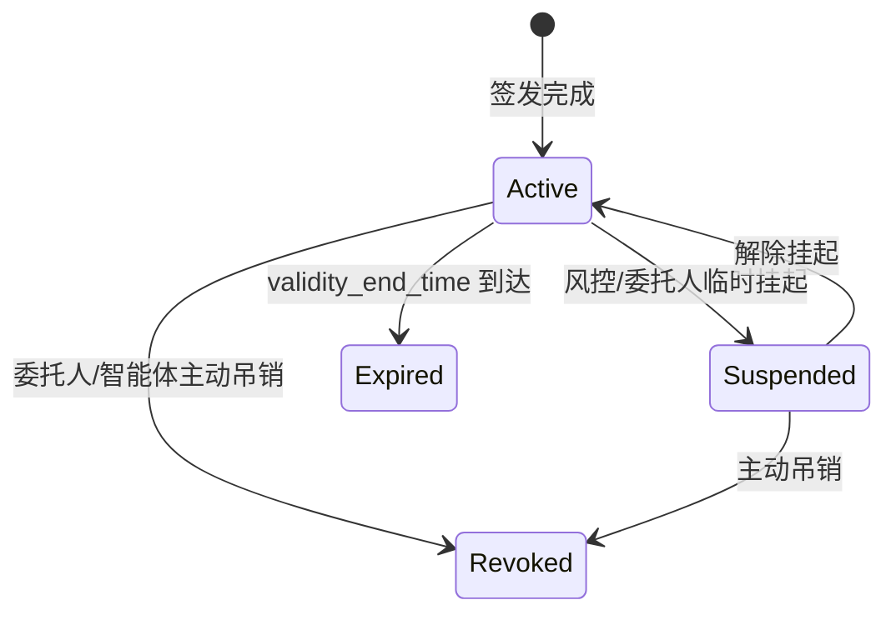

# 委托授权域（Authorization & Delegation Domain, ADD）

## 1 范围

委托授权域（Authorization & Delegation Domain, ADD）是 ACT 协议的起点。本域规范了委托人将其商业意图和行动授权，以可验证的方式赋予智能体的完整过程，从委托人表达自然语言意图，到智能体持有完整有效的用户意图授权凭证，并可凭此在后续商业交互及支付执行中代表委托人行动为止。

**本域范围：**

- 定义用户意图的获取、确认及结构化表达规范；
- 定义用户意图授权凭证的委托模式、签发流程、封装格式与签名规范等；
- 定义意图授权凭证的生命周期状态流转；
- 定义用户委托授权过程中的关键事件类型，供信任服务域异步存证使用。

## 2 术语和定义

### 委托人 Principal

意图的发起方和意图授权凭证的签发方。委托人将特定范围内的商业行动授权赋予受托智能体，并作为所有被授权行为的权益归属主体。

### 意图获取及结构化表达 Intent Capture and Structured Expression, ICS

将用户自然语言意图捕获并转化为结构化表达规则 per 的规范。

### 意图授权凭证 Intent Authorization Credential, IAC

由委托人向智能体签发的、具备密码学可验证性的授权凭证。

## 3 本域协议组件列表

| 协议组件 | 组件描述 |
|---------|---------|
| `ADD-INT-ICS`：意图获取及结构化表达 | 规范委托人向智能体表达自然语言意图，以及智能体解析并获得用户明确确认的交互流程。 |
| `ADD-IAC-ISS`：意图授权凭证签发 | 规范将结构化意图转化为跨域可验证的密码学授权凭证的签发与签名机制。 |
| `ADD-IAC-LCM`：意图授权凭证生命周期管理 | 定义意图授权凭证（IAC）从生效、挂起、恢复到作废、过期的全生命周期状态流转机制。 |

## 4 协议典型场景与域内协议组件的关联

### 场景一：用户即时支付

**场景描述**：本场景适用于用户实时在场（Human-Present）且购买标的已在当次交互中明确的即时购买情形。用户在当次交互中实时完成支付授权，无需预先签发 IAC。

涉及本域组件：

- `ADD-INT-ICS`：系统获取并解析用户的购买意图。

> 注：此场景下不触发意图授权凭证的签发及后续生命周期管理。

### 场景二：用户定向委托支付（平台型智能体）

**场景描述**：本场景适用于用户不在场（Human-Not-Present）且购买标的已在初始交互中明确（即定向委托）的情形。用户需预先签发定向委托类型的意图授权凭证，授权平台型智能体代为完成后续的商业发现与程序化支付。智能体在授权边界内程序化执行，无需用户实时介入。由于平台型智能体采用多租户共享架构（多用户共享同一智能体身份），为防范跨用户的越权与身份混淆，本场景的鉴权机制要求使用"平台智能体身份"与"具体委托人身份"的双重绑定组合来作为支付核验的基准。

涉及本域组件：

- `ADD-INT-ICS`：平台型智能体获取并解析用户的定向购买意图；
- `ADD-IAC-ISS`：委托人通过平台型智能体发起意图授权凭证签发（`delegation_mode` 为定向委托类型）；
- `ADD-IAC-LCM`：业务完成、凭证到期自动失效，或由于业务终止而被委托人主动吊销。

### 场景三：用户定向委托支付（专属型智能体）

**场景描述**：本场景适用于用户不在场（Human-Not-Present）且购买标的已在初始交互中明确（即定向委托）的情形。用户需预先签发定向委托类型的意图授权凭证，授权其一对一绑定的专属型智能体代为完成后续的商业发现与程序化支付。与平台型智能体多租户共享的架构不同，专属型智能体与用户设备或账号强绑定，拥有独立且唯一的专属智能体身份。本场景的鉴权机制直接锚定该专属智能体身份进行核验，并支持通过为智能体设立独立子账户（预充值或限额授权），实现支付行为与用户主账户的资金风险隔离。

涉及本域组件：

- `ADD-INT-ICS`：专属型智能体获取并解析用户的定向购买意图；
- `ADD-IAC-ISS`：委托人通过专属型智能体发起意图授权凭证签发（`delegation_mode` 为定向委托类型）；
- `ADD-IAC-LCM`：业务完成、凭证到期自动失效，或由于业务终止而被委托人主动吊销。

### 场景四：智能体自主委托支付

**场景描述**：本场景适用于用户不在场（Human-Not-Present）且购买标的由智能体在执行过程中自主决策（即自主委托）的情形。与场景二、三的定向委托不同，用户无需预先明确具体的购买标的，只需设定任务目标与行为边界（如总预算上限、品类范围、有效时间窗口）。在该授权边界内，智能体被赋予了高度的决策自主权，可自主完成子任务拆解、服务发现，并自主进行多次智能体对智能体（A2A）的交易，全程可无需用户逐笔介入确认。为确保资金隔离与机器间高频交易的安全，本场景要求买方智能体应使用专属独立子账户，与用户主账户进行资金风险隔离。

涉及本域组件：

- `ADD-INT-ICS`：智能体获取并解析复杂的任务目标与约束边界；
- `ADD-IAC-ISS`：委托人通过智能体发起意图授权凭证签发（`delegation_mode` 为自主委托类型，赋予智能体在边界内的自主行动权）；
- `ADD-IAC-LCM`：任务完成、凭证到期自动失效，或发生资金超额预警时被系统/委托人主动吊销等。

## 5 域内协议组件描述

### 5.1 ADD-INT-ICS：意图获取及结构化表达

#### 5.1.1 概述

用户意图表达与确认（Intent Expression and Confirmation）规范了委托人向智能体表达委托意图的交互过程，以及智能体对原始意图进行结构化理解并获得委托人明确确认的流程。

#### 5.1.2 意图输入方式

当前协议中，主要支持委托人表达意图的输入方式以文本（Text）为主。

> 注：后续版本将进一步补充语音、图片、交互式卡片等多模态意图输入的处理方式。

#### 5.1.3 意图确认流程

1. **用户意图描述**：委托人向用户侧智能体表述商业意图。智能体在接收意图后进行初步语义理解，提取核心商业要素（如品类、金额上限、时间要求等），并生成意图的初始唯一标识。同时，智能体应在本地保存委托人的原始意图以备后续溯源。
2. **意图解析与澄清**：智能体对委托人意图进行深度解析，将自然语言表述映射为本协议定义的意图获取及结构化表达规则（ICS）草稿。在映射过程中，智能体需评估是否需要向委托人进行意图澄清（例如：当委托人表述模糊、核心约束字段缺失，或预算不合理时）。智能体可与委托人进行多轮交互以逐步完善 ICS 草稿；具体的交互形式（如文本、语音、UI 卡片等）及澄清触发的推理逻辑，属于应用层智能体内部实现，不在本协议规范范围内。
3. **意图确认**：经过解析与澄清后的意图，应以用户可读的结构化摘要形式（如确认卡片）展示给委托人进行确认。在确认后，如需进一步签署意图授权凭证，可参照 `ADD-IAC-ISS` 规范中的流程。
4. **【存证】**用户意图确认完成后，智能体可异步上报 `act:delegation:intent-created` 存证事件。

#### 5.1.4 意图原文的处理

智能体宜在本地保留委托人的原始意图描述，保留期限宜不短于对应委托任务完成后的合理争议处理周期，以备事后争议取证使用。具体留存时长可由实现方依据适用的数据保护法律法规自行确定。

---

## 6 本域涉及的存证事件定义

本域可在以下节点触发存证事件，由智能体或其代理存证服务商向信任服务域构建的联盟链（ACT Trust Chain）异步上报：

| 事件类型标识 | 触发时机 |
|-------------|---------|
| `act:delegation:intent-created` | `ADD-INT-ICS` 确认完成 |
| `act:delegation:delegation-issued` | IAC 完成签发 |
| `act:delegation:delegation-suspended` | IAC 凭证被风控引擎或委托人临时挂起时触发 |
| `act:delegation:delegation-resumed` | IAC 从 `Suspended` 状态成功解封并恢复为 `Active` 时触发 |
| `act:delegation:delegation-revoked` | IAC 主动吊销 |
| `act:delegation:delegation-expired` | IAC 自动过期 |
| `intent_id` | string | 必填 | 意图生命周期唯一标识 |
| `delegation_id` | string | 可选 | IAC 凭证唯一标识；仅在签发 IAC 的场景下必填 |
| `delegation_mode` | string | 必填 | 授权模式：`SPECIFIED` / `BOUNDED` |
| `validity_start_time` | string | 必填 | 凭证生效时间（ISO 8601 UTC） |
| `validity_end_time` | string | 必填 | 凭证失效时间；应晚于 `validity_start_time`（ISO 8601 UTC） |
| `max_total_amount` | number | 必填 | 授权总金额上限；应 ≥ 0，精度保留 2 位小数 |
| `amount_currency` | string | 必填 | 金额币种（ISO 4217） |
| `allowed_payment_methods` | array\[string\] | 必填 | 允许的支付方式列表 |
| `signer_identity` | string | 必填 | 签名方身份标识 |
| `agent_id` | string | 必填 | 执行智能体身份标识 |
| `user_confirmation_method` | string | 可选 | 用户确认方式；在用户发生核身确认的时候填写；`FACE_RECOGNITION` / `FINGERPRINT` / `PASSWORD` / `OTP` |
| `user_confirmation_timestamp` | string | 可选 | 用户确认时间；与 `user_confirmation_method` 同步存在（ISO 8601 UTC） |

关于 `delegation_mode` 的取值说明：

| 枚举值 | 语义 | 系统判断依据 |
|--------|------|-------------|
| `SPECIFIED` | 定向委托：IAC 授权范围已锁定在明确的购买标的（即买方已知"买什么"或"付给谁"） | ISR 载荷中配置了具体的商户白名单（`allowed_merchants`）或极其明确的单品/类目约束 |
| `BOUNDED` | 自主委托：IAC 仅设定任务级目标与资金行为边界，具体购买标的由智能体在执行中自主决策 | ISR 载荷中仅包含总预算上限（`max_total_amount`）与宽泛的行业品类，无具体商户约束 |

#### 5.2.3 扩展字段

考虑到不同商业场景对意图结构化表达字段的要求差异比较大，本协议不求穷举所有业务字段，而是定义 `ext` 对象作为扩展命名空间，并采用"协议标准扩展 + 厂商私有扩展"相结合的处理机制，以兼顾下游商户平台的对接可行性与智能体生态的灵活性。

##### 协议标准扩展

对于跨行业通用的一些扩展字段，本协议维护一套标准扩展字典。本版本预定义以下三个标准扩展块节点及其常用字段：

**`ext.commerce`（商品与商户约束）**：

- `max_single_amount`（单笔最高金额）
- `min_single_amount`（单笔最低金额）
- `allowed_categories`（品类白名单）
- `forbidden_categories`（品类黑名单）
- `allowed_merchants`（商户白名单）
- `forbidden_merchants`（商户黑名单）

**`ext.agent_behavior`（智能体行为策略）**：

- `price_change_tolerance`（价格变动容差百分比，如 5.0）
- `price_change_action`（超出容差时行为：`PAUSE_AND_NOTIFY` 暂停并通知，或 `AUTO_CANCEL` 自动取消）
- `on_payment_failure`（支付失败处理：`AUTO_RETRY` 自动重试，或 `CANCEL`）
- `max_retry_count`（默认值建议为 3）

**`ext.fulfillment`（履约要求）**：

- `delivery_time_requirement`（配送时效要求）
- `delivery_address`（配送地址）

基本字段与标准扩展字段的 JSON 报文示例：

```json
{
  "user_intent_raw": "帮我每个月自动续费我的中国移动手机号 138xxxxxxxx，套餐费用约 129 元",
  "intent_id": "urn:uuid:550e8400-e29b-41d4-a716-446655440000",
  "delegation_id": "urn:uuid:7f3e9a12-b4c8-4d56-a321-8b7c6d5e4f30",
  "delegation_mode": "SPECIFIED",
  "validity_start_time": "2026-03-19T00:00:00Z",
  "validity_end_time": "2026-06-19T23:59:59Z",
  "max_total_amount": 450.00,
  "amount_currency": "CNY",
  "allowed_payment_methods": [
    "urn:act:payment:example-wallet"
  ],
  "signer_identity": "did:act:example.com/user-alice",
  "agent_id": "did:act:example.com/agent-alice-001",
  "user_confirmation_method": "FINGERPRINT",
  "user_confirmation_timestamp": "2026-03-19T09:42:17Z",
  "ext": {
    "commerce": {
      "allowed_merchants": [
        "urn:act:merchant:example-merchant"
      ],
      "max_single_amount": 150.00
    },
    "agent_behavior": {
      "price_change_tolerance": 10.0,
      "price_change_action": "PAUSE_AND_NOTIFY",
      "on_payment_failure": "AUTO_RETRY",
      "max_retry_count": 3
    }
  }
}
```

##### 厂商私有扩展与动态解析

对于高度定制化的业务约束（如航司的舱位等级要求、平台专属的会员权益参数等），本协议允许通过 `ext.vendor_private` 作为标识进行私有扩展字段的承载。

为使对接的外部系统能够理解这些字段，智能体或商户平台可公开其支持的 JSON Schema URL 供外部系统动态解析。各实现方在使用该机制时应遵循以下最小约束：

- 安全寻址：Schema URL 应仅通过 HTTPS 协议提供，且 Schema 文档宜包含明确的版本标识字段；
- 容错与兼容：接收方在因网络等原因无法获取对应 Schema，或解析后仍存在未知字段时，宜直接忽略 `ext.vendor_private` 中的未知内容，而不应因无法解析私有扩展字段而拒绝处理整个核心 ISR 载荷。

> 注：本机制在本版本中为可选实验性功能，后续版本会进一步评估和细化。

### 5.2 ADD-IAC-ISS：意图授权凭证签发

#### 5.3.2 签发流程

智能体在获得委托人对意图规则的确认后，应按以下步骤完成 IAC 的签发：

1. **载荷构造与规范化**：智能体基于已确认的 ISR，构造待签名的意图授权凭证载荷（Payload）。智能体应根据当前的委托任务特性，自主判断并在载荷中设定合适的 `delegation_mode`。为保证跨域多方验签哈希的一致性，智能体应对载荷执行 RFC 8785（JSON Canonicalization Scheme, JCS）规范化处理。
2. **唤起核身与执行签名**：智能体向委托人发起核身请求（如生物识别或密码验证）。在委托人核身通过后，智能体系统调用与该委托人身份绑定的私钥，对步骤 1 中规范化后的载荷字节序列计算生成数字签名值，并同步记录下完成核身的时间戳及核身方式。

> **外部安全接口依赖**
>
> 上述流程中，核身与执行签名过程依赖以下安全能力，ACT 协议规范不绑定具体实现：
>
> | 接口 | 能力要求 | 本组件使用场景 |
> |------|---------|-------------|
> | 签名服务 (SigningService) | 对规范化载荷执行数字签名，返回签名值、算法标识和时间戳 | IAC 签发 |
> | 核身服务 (AuthenticationService) | 验证用户身份，返回核身方式与时间戳 | IAC 签发前的用户确认 |
> | 密钥管理服务 (KeyManagementService) | 密钥生成、存储、访问控制，私钥不可导出 | 签名密钥的生命周期管理 |
>
> 以上接口的输入输出契约详见 [外部安全接口定义](../appendix/security-interfaces.md)。

3. **凭证封装**：在获取到签名结果后，智能体按照 W3C VC-JWT 标准格式，将意图授权载荷（置于 `vc.credentialSubject` 中）与生成的签名数据、凭证生命周期声明（如 `exp` 失效时间）组装在一起，形成最终的意图授权凭证。
4. **【存证】意图授权凭证签发事件存证**：在完成 IAC 签发后，智能体宜异步发起 `act:delegation:delegation-issued` 事件的存证上报，建立后续委托支付业务链路的信任起点。

#### 5.3.3 封装格式

采用 W3C VC-JWT（`vc+jwt`）格式封装。结构要求如下：

- **JWS Protected Header**：包含算法声明（`alg`，为 `ES256` 或 `SM2-SM3`）、公钥寻址标识（`kid`）及令牌类型（`typ: vc+jwt`）。
- **JWS Payload (Claims)**：
  - W3C 标准字段：`iss`（签发方）、`sub`（受托方）、`jti`（凭证标识，等于 `delegation_id`）、签发与过期时间（`iat` / `exp`）；
  - VC 核心结构：声明 `vc.type` 包含 `ACTIntentAuthorization`，并将上述完成组装的意图授权载荷放入 `vc.credentialSubject` 对象中。

**规范化计算要求**：各实现方在进行 JSON 规范化（RFC 8785 JSON Canonicalization Scheme）以计算签名哈希时，应保留意图授权载荷中字段的原文命名。若序列化框架执行了非预期的格式转换（如将 snake_case 格式强制转为驼峰命名），将可能导致后续依赖方的验签失败。

以下为一个完整 IAC 的参考示例：

```json
{
  "alg": "ES256",
  "kid": "did:act:example.com/user-alice#key-1",
  "typ": "vc+jwt"
}
```

```json
{
  "iss": "did:act:example.com/user-alice",
  "sub": "did:act:example.com/agent-alice-001",
  "jti": "urn:uuid:7f3e9a12-b4c8-4d56-a321-8b7c6d5e4f30",
  "iat": 1742377337,
  "exp": 1750377599,
  "vc": {
    "type": ["VerifiableCredential", "ACTIntentAuthorization"],
    "credentialSubject": {
      "user_intent_raw": "帮我每个月自动续费我的中国移动手机号 138xxxxxxxx，套餐费用约 129 元",
      "intent_id": "urn:uuid:550e8400-e29b-41d4-a716-446655440000",
      "delegation_id": "urn:uuid:7f3e9a12-b4c8-4d56-a321-8b7c6d5e4f30",
      "delegation_mode": "SPECIFIED",
      "validity_start_time": "2026-03-19T00:00:00Z",
      "validity_end_time": "2026-06-19T23:59:59Z",
      "max_total_amount": 450.00,
      "amount_currency": "CNY",
      "allowed_payment_methods": [
        "urn:act:payment:example-wallet"
      ],
      "signer_identity": "did:act:example.com/user-alice",
      "agent_id": "did:act:example.com/agent-alice-001",
      "user_confirmation_method": "FINGERPRINT",
      "user_confirmation_timestamp": "2026-03-19T09:42:17Z",
      "ext": {
        "commerce": {
          "allowed_merchants": [
            "urn:act:merchant:example-merchant"
          ],
          "max_single_amount": 150.00
        },
        "agent_behavior": {
          "price_change_tolerance": 10.0,
          "price_change_action": "PAUSE_AND_NOTIFY",
          "on_payment_failure": "AUTO_RETRY",
          "max_retry_count": 3
        }
      }
    }
  }
}
```

```
// JWS Signature（对 credentialSubject 进行 RFC 8785 规范化序列化后执行 ES256 签名，Base64url 编码）
MEYCIQDtv8Qw3Xv6kZnP2mJaLcR5oN1yFgHsIbKdWxPqE7u4vAIhAOzR9sYmCnXpL3kQwBjTfN2aGdHe5VuMrXoIPcKs8Zt1
```

### 5.3 ADD-IAC-LCM：IAC 生命周期管理

#### 5.2.1 概述

IAC 生命周期管理（Intent Authorization Credential Life Cycle Management）定义了 IAC 的标准状态机。

#### 5.3.2 状态机定义

IAC 在其生命周期内的合法状态及流转规则如下：



状态定义表：

| 状态值 | 语义 | 触发条件 | 可恢复性 |
|--------|------|---------|---------|
| `Active` | 有效，可用于商业交互与支付 | IAC 已签发且在有效期内 | — |
| `Suspended` | 暂停，临时不可使用 | 风控系统或委托人发起临时挂起；凭证未终止 | 可恢复 |
| `Expired` | 已过期，不可使用 | `validity_end_time` 到达，系统自动触发 | 不可恢复 |
| `Revoked` | 已吊销，永久不可使用 | 委托人或受托智能体主动触发永久吊销 | 不可恢复 |

#### 5.3.3 临时挂起

委托人或风控系统可在 IAC 有效期内主动触发临时挂起。挂起后，IAC 状态流转为 `Suspended`。此时，任何以该 IAC 构造的支付载荷，PSP 都应拒绝处理。

【存证】智能体宜异步上报 `act:delegation:delegation-suspended` 存证事件。

#### 5.3.4 解除挂起

处于 `Suspended` 状态的 IAC，可由委托人或风控系统发起解除挂起操作。解除后，IAC 状态恢复为 `Active`，此时可正常商业交互与支付。

【存证】智能体宜异步上报 `act:delegation:delegation-resumed` 存证事件。

#### 5.3.5 吊销

委托人或受托智能体可在 IAC 有效期内主动触发吊销。吊销后，IAC 状态流转为 `Revoked`。后续任何以该 IAC 构造的支付载荷，PSP 都应拒绝处理。

【存证】智能体宜异步上报 `act:delegation:delegation-revoked` 存证事件。

#### 5.3.6 到期自动处理

当 `validity_end_time` 到达时，IAC 状态应自动流转为 `Expired`。后续任何以该 IAC 构造的支付载荷，PSP 都应拒绝处理。

【存证】智能体宜异步上报 `act:delegation:delegation-expired` 存证事件。

## 6 本域涉及的存证事件定义

本域可在以下节点触发存证事件，由智能体或其代理存证服务商向信任服务域构建的联盟链（ACT Trust Chain）异步上报：

| 事件类型标识 | 触发时机 |
|-------------|---------|
| `act:delegation:intent-created` | `ADD-INT-ICS` 确认完成 |
| `act:delegation:delegation-issued` | IAC 完成签发 |
| `act:delegation:delegation-suspended` | IAC 凭证被风控引擎或委托人临时挂起时触发 |
| `act:delegation:delegation-resumed` | IAC 从 `Suspended` 状态成功解封并恢复为 `Active` 时触发 |
| `act:delegation:delegation-revoked` | IAC 主动吊销 |
| `act:delegation:delegation-expired` | IAC 自动过期 |