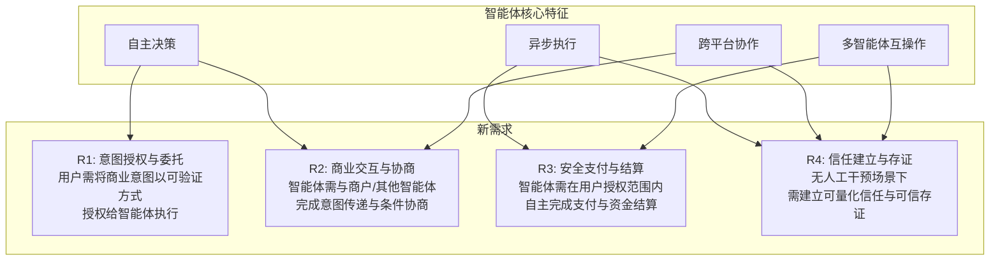
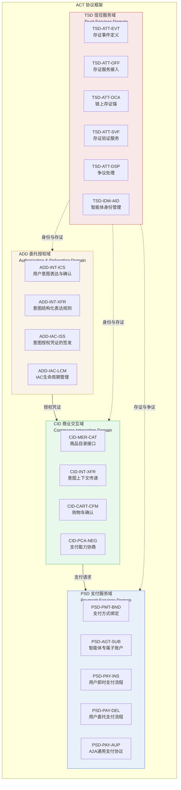

# ACT 协议概览

## 1 协议推出背景

### 1.1 智能体商业产业变革

智能体（Agent）技术的快速演进正在驱动商业模式的深层变革。与传统软件服务不同，智能体具备以下核心特征，这些特征对现有商业基础设施提出了全新的要求：

- **自主决策**：智能体能够基于预设目标与实时上下文，独立完成推理、规划与决策，无需人类逐步干预。这使得商业交互从"人驱动操作"转变为"智能体代理决策"。
- **异步执行**：智能体可长时间异步运行，在等待外部事件或子任务完成期间不阻塞主流程。这意味着商业协议需要支持非即时响应的交互模式与超时容错机制。
- **跨平台协作**：智能体需要在多个平台与服务之间协同工作，组合不同能力以完成复杂商业任务。这要求打破平台壁垒，建立跨域互操作标准。
- **多智能体间互操作**：不同开发者、不同供应商提供的智能体需要能够发现、理解并调用彼此的能力，形成开放协作的商业生态。

### 1.2 智能体商业对现有商业基础设施带来的新需求

上述特征使得智能体商业与传统电商、API 调用等模式存在本质差异，对现有商业基础设施提出了一系列新需求：

> **图1 智能体商业需求分析模型**

| 需求编号 | 需求名称 | 问题描述 | 现有基础设施差距 |
|---------|---------|---------|----------------|
| R1 | 意图授权与委托 | 用户需将商业意图以结构化、可验证的方式授权给智能体，并管理授权凭证的生命周期 | 现有授权机制以 API Key / OAuth 为主，缺少面向商业意图的细粒度委托与凭证管理 |
| R2 | 商业交互与协商 | 智能体需与商户或其他智能体完成意图传递、商品发现、支付能力协商与购物车确认 | 现有 API 调用缺少语义化的意图传递与协商机制，无法支持智能体级自动化交互 |
| R3 | 安全支付与结算 | 智能体需在用户授权范围内自主完成支付确认、资金划拨，并支持智能体间直接支付 | 现有支付系统依赖人工确认与同步交互，缺少面向智能体的支付协议与委托支付机制 |
| R4 | 信任建立与存证 | 智能体间交互需可审计、可存证，且需在无历史交互情况下建立初始信任 | 现有信任模型基于品牌与声誉，缺少适合智能体场景的可计算信任框架与可信存证机制 |

---

## 2 ACT 协议框架

### 2.1 协议设计原则

ACT 协议的设计遵循以下原则：

| 原则 | 说明 |
|------|------|
| **兼容性** | 协议应与现有互联网标准与商业基础设施兼容，支持渐进式接入，避免要求参与方进行激进的系统改造 |
| **渐进演进** | 协议采用分层与模块化设计，各子协议可独立演进；实现方可按需选择子集，逐步扩展能力覆盖 |
| **开放性** | 协议规范开放、过程透明，任何人均可参与讨论与实现，不设排他性准入门槛 |
| **包容性** | 协议不绑定特定技术栈、平台或供应商，支持多样化的实现方式与部署形态 |
| **可组合性** | 协议的各子规范可自由组合，支持不同商业场景灵活裁剪与扩展 |
| **安全与隐私优先** | 协议设计将安全与隐私作为首要约束，默认采用最小权限原则与数据最小化策略 |
| **实体与角色分离** | 协议将参与方（实体）与其在交互中承担的角色解耦，同一实体可在不同场景扮演不同角色 |

### 2.2 协议框架

ACT 协议框架由四个域（Domain）构成，各域包含一组功能组件，共同覆盖智能体商业交互的完整生命周期：

> **图2 ACT 协议框架**

### 2.3 协议栈构成

ACT 协议栈由以下四个域组成，各域定义独立的子规范，协同实现智能体商业的全流程闭环：

#### 2.3.1 ADD -- 委托授权域（Authorization & Delegation Domain）

ADD 域解决"用户意图如何可信地授权给智能体"的问题。本域规范了委托人将其商业意图和行动授权，以可验证的方式赋予智能体的完整过程，从委托人表达自然语言意图，到智能体持有完整有效的意图授权凭证（IAC），并可凭此在后续商业交互及支付执行中代表委托人行动为止。

核心组件：

| 组件 | 功能概述 |
|------|---------|
| ADD-INT-ICS：意图获取及结构化表达 | 规范委托人向智能体表达自然语言意图，以及智能体解析并获得用户明确确认的交互流程 |
| ADD-IAC-ISS：意图授权凭证签发 | 规范将结构化意图转化为跨域可验证的密码学授权凭证（IAC）的签发与签名机制 |
| ADD-IAC-LCM：IAC 生命周期管理 | 定义 IAC 从生效、挂起、恢复到作废、过期的全生命周期状态流转机制 |

详细规范参见 [ADD 域规范](./add/spec.md)。

#### 2.3.2 CID -- 商业交互域（Commerce Interaction Domain）

CID 域解决"智能体如何与商户/其他智能体交互"的问题。本域定义了智能体与商户（含商户侧智能体）或其他智能体之间，围绕商品/服务发现、意图传递、内容协商、支付能力协商、购物车确认等环节所遵循的交互规范。

核心组件：

| 组件 | 功能概述 |
|------|---------|
| CID-MER-CAT：商品目录接口 | 定义商户商品/服务信息的结构化描述格式，供买方智能体发现与匹配 |
| CID-INT-XFR：意图上下文传递 | 规范买方智能体向商户或电商平台传递多维意图上下文，以换取精准候选推荐的请求与动态路由机制 |
| CID-CART-CFM：购物车确认 | 规范买卖双方确认最终商品清单、金额，并将交易状态锁定准备进入支付阶段的交互过程 |
| CID-PCA-NEG：支付能力协商 | 规定买卖双方智能体在交易前相互声明并匹配可用支付方式及 PSP 服务端点的握手过程 |

详细规范参见 [CID 域规范](./cid/spec.md)。

#### 2.3.3 PSD -- 支付服务域（Payment Services Domain）

PSD 域解决"智能体如何安全完成支付"的问题。本域定义了智能体在完成购物车确认之后，向支付服务方发起支付的完整交互规范，覆盖支付请求的构造、授权核验、交易执行与结果状态管理等环节。

核心组件：

| 组件 | 功能概述 |
|------|---------|
| PSD-PMT-BND：支付方式绑定 | 规范委托人通过支付标记化技术为智能体安全绑定支付方式及支付标记，实现敏感账号保护的流程 |
| PSD-AGT-SUB：智能体专属子账户管理 | 规范为自主执行的智能体开立具有资金隔离能力的独立子账户，及其配套专属密钥的绑定与生命周期管理要求 |
| PSD-PAY-INS：用户即时支付流程 | 定义在用户在场（Human-Present）场景下，实时完成商品和支付确认的交互流程 |
| PSD-PAY-DEL：用户委托支付流程 | 规范委托人不在场情形下，智能体基于意图授权凭证，在用户设定的规则与限额内由智能体自主完成的支付流程 |
| PSD-PAY-AUP：智能体A2A通用支付协议 | 规范智能体间基于 HTTP 402 语义扩展的通用支付骨架，涵盖"支付挑战-凭证传递-履约回执"的标准交互与状态流转机制 |

详细规范参见 [PSD 域规范](./psd/spec.md)。

#### 2.3.4 TSD -- 信任服务域（Trust Services Domain）

TSD 域解决"如何建立跨机构信任"的问题。本域为 ACT 协议的其他三个域提供底层信任基础设施，包括智能体身份管理、可信存证、存证验证与争议解决等核心能力。

核心组件：

| 组件 | 功能概述 |
|------|---------|
| TSD-ATT-EVT：存证事件定义 | 定义各协议域产生的存证事件的结构化表达格式与上报规范 |
| TSD-ATT-OFF：存证服务接入 | 规范存证服务方的接入要求、存证事件接收与存证记录生成流程 |
| TSD-ATT-OCA：链上存证锚 | 定义存证锚的生成、写入 ACT Trust Chain 及验证机制 |
| TSD-ATT-SVF：存证验证服务 | 规范存证记录与存证锚的验证接口与验证流程 |
| TSD-ATT-DSP：争议处理 | 定义争议提交、调解与裁决的交互流程 |
| TSD-IDM-AID：智能体身份管理 | 定义 `did:act` 身份标识方法、DID Document 结构与解析规则 |

详细规范参见 [TSD 域规范](./tsd/spec.md)。

---

## 3 规范性用语

本文档中的关键词"必须"（MUST）、"绝对不能"（MUST NOT）、"要求"（REQUIRED）、"应当"（SHALL）、"不应当"（SHALL NOT）、"应该"（SHOULD）、"不应该"（SHOULD NOT）、"推荐"（RECOMMENDED）、"可以"（MAY）和"可选"（OPTIONAL）依照 RFC 2119 的规定进行解释。

即：

- **必须** / **MUST** / **REQUIRED** / **SHALL**：表示该要求是协议规范的绝对要求
- **绝对不能** / **MUST NOT** / **SHALL NOT**：表示该要求是协议规范的绝对禁止
- **应该** / **SHOULD** / **RECOMMENDED**：表示在特定情况下存在合理理由忽略该要求，但选择忽略前须充分理解其全部影响
- **不应该** / **SHOULD NOT**：表示在特定情况下存在合理理由采用该行为，但选择采用前须充分理解其全部影响
- **可以** / **MAY** / **OPTIONAL**：表示该条目完全可选

---

## 4 术语表

| 术语 | 英文 | 定义 |
|------|------|------|
| 智能体 | Agent | 具备自主决策能力，可代表实体执行商业交互的软件程序 |
| 委托人 | Principal | 意图的发起方和意图授权凭证的签发方，将特定范围内的商业行动授权赋予受托智能体 |
| 受托智能体 | Delegate Agent | 接受委托人授权，在授权范围内代表委托人执行商业行动的智能体 |
| 意图结构化规则 | Intent Structured Rule (ISR) | 将委托人的商业意图转化后的机器可读约束规则，定义本次委托的约束边界 |
| 意图授权凭证 | Intent Authorization Credential (IAC) | 由委托人向智能体签发的、具备密码学可验证性的授权凭证 |
| 买方智能体 | Buyer Agent | 在商业交互链路中发起意图请求、完成比较决策与购物车确认的智能体 |
| 商户 | Merchant | 提供实际商品或服务，接收交易请求并承担最终订单履约责任的商业实体 |
| 卖方智能体 | Merchant Agent / Seller Agent | 代表商户参与商业交互的智能体，可在授权范围内自主完成意图接收、协商及交易确认 |
| 支付标记 | Payment Token | 支付标记服务方为智能体生成的、用于替代原始支付账户信息的令牌字符串 |
| 支付服务方 | Payment Service Provider (PSP) | 提供支付受理、指令路由与清算服务的机构 |
| 支付标记服务方 | Payment Token Service Provider (PSTP) | 为敏感支付信息提供标记化服务的机构或系统组件 |
| 智能体专属子账户 | Agent-Dedicated Sub-Account | 为特定智能体单独开立的资金子账户，与委托人主账户逻辑隔离 |
| 存证事件 | Attestation Event | 各协议域在关键业务节点产生的、需要被可信记录的结构化事件 |
| 存证服务方 | Attestation Service Provider | 为 ACT 协议生态提供可信存证服务的机构或系统组件 |
| 存证记录 | Attestation Record | 存证服务方在处理存证事件后生成的结构化记录，作为事件已被可信记录的证据 |
| 存证锚 | Attestation Anchor | 存证服务方定期将一批存证记录的聚合摘要写入 ACT Trust Chain 后生成的链上锚点 |
| ACT Trust Chain | ACT Trust Chain | 由信任服务域构建的联盟链，用于承载存证锚的写入与验证 |
| 争议处理 | Dispute Center | 为 ACT 协议生态中的参与方提供争议提交、调解与裁决服务的机构或平台 |
| did:act | did:act | ACT 协议定义的去中心化身份标识方法，基于 W3C DID v1.1 规范 |
| 支付能力声明 | Payment Capability Declaration | 商户或卖方智能体对外发布的、声明所支持支付方式的结构化文档 |
| 支付能力协商 | Payment Capability Negotiation | 买方智能体与商户在发起支付前完成的支付方式匹配与参数对齐过程 |
| 规则自检 | Rule Self-Check | 买方智能体在提交购物车确认前，依据 IAC 约束字段对购买行为进行合规性校验的机制 |

---

## 5 与其他协议的关系

ACT 协议并非孤立存在，而是与当前业界多个智能体相关协议形成互补关系，各协议侧重不同层面，共同构成智能体生态的技术底座：

| 协议 | 侧重领域 | 与 ACT 的关系 |
|------|---------|--------------|
| **A2A**（Agent-to-Agent） | 智能体间任务通信与协作 | A2A 侧重智能体之间的任务委派与状态同步的通信机制；ACT 在此基础上补充了商业闭环能力（身份认证、支付结算、信任评估），使智能体协作从"任务完成"延伸至"商业履约" |
| **MCP**（Model Context Protocol） | 大模型上下文注入与工具调用 | MCP 解决的是大模型如何访问外部工具与数据源的上下文问题；ACT 与 MCP 正交，ACT 关注的智能体商业身份、支付与信任层面是 MCP 未覆盖的 |
| **UCP**（Universal Communication Protocol） | 通用通信协议层 | UCP 提供传输层的通用通信能力；ACT 基于 UCP 等通用传输层构建上层的商业语义协议，两者为上下层关系 |
| **ACP**（Agent Communication Protocol） | 智能体间消息格式与交互语义 | ACP 定义智能体间消息的结构化格式与交互语义规则；ACT 使用 ACP 定义的消息格式作为底层通信载体，在其上定义商业交互特有的语义与流程 |

简言之：ACT 协议定位为**智能体商业层协议**，在通信（UCP/ACP）、协作（A2A）与工具调用（MCP）等已有能力之上，填补身份、支付与信任的商业基础设施空白。